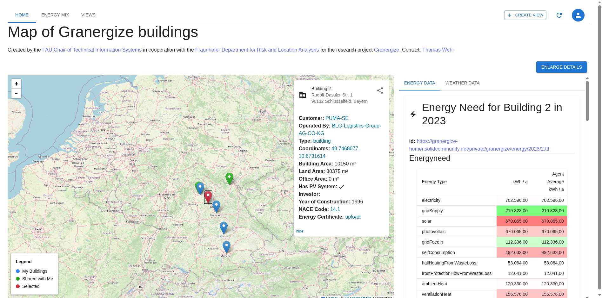

# Granergize WebApp

The Granergize WebApp allows browsing and comparing energy consumption data of different buildings using the [Granergize Ontology](https://solid.ti.rw.fau.de/gra/vocab.ttl#).

## Pre-requisites

- [Deno2](https://deno.land/) installed

## Setup

- Clone the repository
- Run `deno install` to install dependencies
- Run `deno task dev` to start the development server
- Open `http://localhost:5173` in your browser
