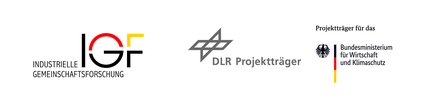

# Granergize WebApp

The Granergize WebApp allows browsing and comparing energy consumption data of
different buildings using the
[Granergize Ontology](https://solid.ti.rw.fau.de/gra/vocab.ttl#).

## Pre-requisites

- [Deno2](https://deno.land/) installed

## Setup

- Clone the repository
- Run `deno install` to install dependencies
- Run `deno task dev` to start the development server
- Open `http://localhost:5173` in your browser
- Run `deno task dev:local` (or `dev:local:jss`) for a fully local stack — a
  throwaway Pod + IdP with seeded logins, no remote Pod needed
- To keep that local Pod's data across restarts, point it at a directory:
  `LOCAL_POD_DATA=.local-pod deno task dev:local`. The accounts and everything
  you saved come back on the next start (CSS backend only; the test lanes
  always stay throwaway)

## Quick start

The app stores everything in your own [Solid](https://solidproject.org/) Pod,
so a fresh login shows an empty dashboard: nothing is seeded. To see the app
with data in it, import one of the bundled example files. They take exactly the
same path as your own spreadsheet would.

1. You need a Solid Pod. Any Solid identity provider works; if you don't have
   one yet, register at a public provider such as
   [solidcommunity.net](https://solidcommunity.net/) or
   [Inrupt PodSpaces](https://start.inrupt.com/). Then run `deno task dev`,
   open `http://localhost:5173`, and enter your identity provider on the login
   screen.
2. Log in, open **Buildings**, and click **Autofill from file**.
3. Below the file picker, under
   "…or try one of the bundled example files", pick one:
   - **Logistics portfolio Nürnberg** — 37 real logistics buildings with
     annual energy figures for 2022–2024. The largest set; shows the map,
     the over-time heatmap, the pivot roll-ups and the benchmarks.
   - **Sample portfolio** — 4 fictional buildings in the row-label sheet
     layout, without coordinates, so you can watch the app geocode them on
     import.
   - **15-minute load profile (Lastgang)** — a two-week sub-hourly series for
     one building, which renders the time-series chart.

The files live in `public/examples/` and are ordinary spreadsheets. An
exported building re-imports the same way, so an export doubles as the import
template for your own data. The [handbook](docs/handbuch.md) walks through
the app using exactly these example buildings.

## Funding

Granergize is a project of the Industrial Collective Research (IGF), funded by
the German Federal Ministry for Economic Affairs and Climate Action (BMWK) on
the basis of a resolution of the German Bundestag. Funding reference
**01IF23286N** (duration April 2024 – June 2026).

## License

Copyright (C) 2025–2026 Thomas Wehr, Andreas Harth and the Granergize project
contributors.

This program is free software: you can redistribute it and/or modify it under
the terms of the **GNU Affero General Public License, Version 3** (AGPL-3.0) as
published by the Free Software Foundation. See the [`LICENSE`](LICENSE) file for
the full text.

Because the AGPL is designed for network-served software, anyone who runs a
modified version of this app as a network service must offer the corresponding
source code to its users.
