<!--
  QUELLE DES PRAXISHANDBUCHS — diese Markdown-Datei ist die maßgebliche Quelle.
  PDF + DOCX werden daraus erzeugt:  deno task handbuch
  App-Screenshots liegen unter docs/figures/ (erzeugt von e2e/screenshots.spec.ts);
  die konzeptionellen Abbildungen (Architektur, WAC, Wissensgraph, Sharing-
  Vergleich) wurden aus dem ursprünglichen Handbuch übernommen.
  Abschnitte mit der Überschrift „Technische Details" richten sich an technische
  Anwender und Administratoren und können beim Lesen übersprungen werden.
-->

# Was dieses Praxishandbuch leistet und für wen es gedacht ist

Dieses Praxishandbuch bietet eine anwendungsorientierte Einführung in die
Konzeption und Nutzung von Granergize – einer Anwendung, die einen
Wissensgraphen für Energieverbrauchsdaten von Logistikimmobilien nutzbar macht.
Ziel ist es, heterogene Datenquellen zu integrieren, semantisch zu
harmonisieren und für Analyse-, Benchmarking- und Entscheidungsprozesse nutzbar
zu machen.

Vor dem Hintergrund von Datensilos, uneinheitlichen Datenformaten und
unterschiedlichen Anforderungen der beteiligten Akteure zeigt das Handbuch
praxisnah, wie ein semantisches Datenschema einschließlich Ontologie die
Transparenz, Interoperabilität und Vergleichbarkeit von Energieverbrauchsdaten
verbessern kann. Gleichzeitig wird erläutert, wie ein sicherer, kontrollierter
und flexibler Datenaustausch innerhalb des Immobilienökosystems ermöglicht wird.

Darüber hinaus schafft das Handbuch die Grundlage für datengetriebene
Optimierungsansätze zur Steigerung der Energieeffizienz sowie zur Unterstützung
regulatorischer Anforderungen, insbesondere im Bereich Nachhaltigkeit und
CO~2~-Bilanzierung.

Die Zielgruppe umfasst alle Akteure des Logistikimmobilienökosystems,
insbesondere Nutzer und Eigentümer von Logistikimmobilien, Investoren, Facility
Manager, Makler, Berater sowie Software-, Energie- und Benchmark-Dienstleister.
Es richtet sich gleichermaßen an fachliche wie technische Anwender und verbindet
fachliche Grundlagen mit praxisnaher Anwendung.

# Vom Problem zur Lösung: Energieverbrauchsdaten nutzbar machen

## Warum Energieverbrauchsdaten bislang nur eingeschränkt zugänglich sind

Energieverbrauchsdaten von Logistikimmobilien liegen häufig in Datensilos und
sind in der Praxis nur schwer zugänglich. Das komplexe Ökosystem verstärkt diese
Problematik: Die unterschiedlichen Akteure verwenden eigene Systeme,
verschiedene Datenformate und Modelle. Verbrauchsdaten liegen daher in
variierenden Strukturen, Granularitäten und Zeitauflösungen vor. Diese
Heterogenität erschwert das Teilen von Daten; Datenaustausch und Vergleichbarkeit
sind bislang nur eingeschränkt gegeben.

Gleichzeitig bilden Logistikimmobilien zentrale Knotenpunkte logistischer
Netzwerke und übernehmen eine entscheidende Rolle bei der Erbringung logistischer
Dienstleistungen. Vor dem Hintergrund steigender Strom- und Gaspreise sowie
wachsender regulatorischer Anforderungen, insbesondere im Kontext von
Nachhaltigkeit und CO~2~-Bilanzierung durch konkrete EU-Taxonomien, gewinnt die
Energieeffizienz von Logistikimmobilien zunehmend an Bedeutung.

Dennoch bestehen erhebliche Herausforderungen: Die komplexe Akteurslandschaft mit
unterschiedlichen Perspektiven auf den Energieverbrauch erschwert den Zugang zu
entscheidenden Daten. Die Mobilisierung dieser Daten innerhalb der Unternehmen
erfordert zudem hohen manuellen Aufwand. Auch die Vielfalt der Gebäudetypen und
unterschiedliche Nutzungsregimes erschweren die Vergleichbarkeit der jeweiligen
Informationen.

## Der Wissensgraph als Schlüssel

Wissensgraphen bieten die geeignete technologische Grundlage, um diesen
Herausforderungen zu begegnen. Sie ermöglichen es, heterogene Daten aus
unterschiedlichen Quellen in einem einheitlichen, semantisch beschriebenen
Modell zusammenzuführen, ohne dass bestehende Systeme vollständig vereinheitlicht
werden müssen. Durch die explizite Modellierung von Entitäten (z. B. Gebäude
oder Zähler) und deren Beziehungen können Daten zudem nicht nur integriert,
sondern auch in den Kontext gesetzt und damit besser interpretiert werden.

Daher wird dieser Ansatz im Projekt Granergize aufgegriffen und ein einheitliches
Datenmodell entwickelt. Damit wird eine gemeinsame semantische Grundlage
etabliert, die einen sicheren und kontrollierten Datenaustausch im gesamten
Immobilienökosystem ermöglicht. Gleichzeitig wird die Voraussetzung für internes
sowie externes Benchmarking geschaffen, ohne die Datenhoheit der einzelnen
Beteiligten einzuschränken: Innerhalb des Ökosystems kann demnach jeder Akteur
selbst bestimmen, mit wem er welche Daten in welcher Granularität und Frequenz
teilen möchte.

Damit bilden Wissensgraphen eine zentrale Brücke zwischen der aktuell heterogenen
Datenlandschaft und einer zukunftsfähigen, datengetriebenen Steuerung von
Energieeffizienz in Logistikimmobilien.

## Praxisbeispiele: Use Cases für die Anwendung

### Energieverbrauchsbenchmark

Das systematische Benchmarking von Energieverbräuchen bildet einen zentralen
Anwendungsfall. Ziel ist es, Energieverbräuche auf Objektebene transparent und
vergleichbar zu machen, um einzelne Immobilien innerhalb eines geeigneten
Vergleichsfeldes (z. B. nach Nutzungsart, Größe oder Betriebsprofil) einordnen
zu können. Auf diese Weise können besonders effiziente oder ineffiziente Objekte
identifiziert und fundierte Bewertungen der energetischen Performance vorgenommen
werden. Liegen zusätzlich detaillierte Messdaten vor, können darüber hinaus
Optimierungspotenziale erkannt und konkrete Verbesserungsmaßnahmen abgeleitet
werden. Für die Umsetzung werden insbesondere Objekt-, Nutzungs- sowie
Verbrauchsdaten benötigt, sowohl in aggregierter als auch in detaillierter Form.
Besonders relevant ist dieser Use Case für Nutzer, Investoren bzw.
Bestandshalter, Facility Manager und spezialisierte Benchmarking-Anbieter.

### Soll-Ist-Vergleich

Ein weiterer zentraler Anwendungsfall ist die Durchführung von
Soll-Ist-Vergleichen. Dabei werden tatsächliche Energieverbräuche systematisch
den geplanten, erwarteten oder referenzierten Werten gegenübergestellt und
miteinander verglichen. So können Abweichungen frühzeitig erkannt und die
energetische Performance des Gebäudes fundiert bewertet werden. Als Referenzwerte
dienen u. a. Energiebedarfs- oder Verbrauchsausweise oder Verbrauchsprognosen,
z. B. auf Basis des definierten Nutzungsregimes oder der vorgegebenen
Raumtemperatur. Zudem können erwartete Einsparungen aus Investitionsmaßnahmen wie
Umrüstungen auf LED oder KNX-basierte Gebäudeautomation überprüft werden. Dieser
Soll-Ist-Vergleich ermöglicht es, die Wirksamkeit technischer und
organisatorischer Maßnahmen nachvollziehbar zu überprüfen und den erzielten
Return on Investment zu belegen. Voraussetzung sind belastbare Soll-Verbrauchs-
und Betriebsdaten sowie die jeweiligen granularen Ist-Daten; ergänzend werden
Wetterdaten benötigt, um äußere Einflüsse zu berücksichtigen. Besonders relevant
für Nutzer, Gebäudetechnikausstatter, Investoren, Facility Manager und
Projektentwickler.

Granergize unterstützt diesen Anwendungsfall direkt: Zu jedem Gebäude und Jahr
können neben den Ist-Werten auch geplante (Soll-)Werte erfasst und in der
Energieansicht nebeneinander dargestellt werden (siehe Abschnitt „Energiedaten
erfassen und aktualisieren").

### Vertriebsoptimierung

Ein weiterer relevanter Anwendungsfall ist die Unterstützung vertrieblicher
Prozesse auf Basis energiebezogener Gebäude- und Standortdaten. Ziel ist es,
Logistik- und Gewerbeobjekte systematisch zu verorten sowie hinsichtlich ihrer
energetischen Eigenschaften zu visualisieren. Eine visuelle Kategorisierung
anhand des Energieverbrauchs erleichtert die Einordnung der jeweiligen
Logistikimmobilie in ihr Wettbewerbsumfeld. So kann hervorgehoben werden, dass
eine Immobilie im Vergleich zu benachbarten Hallen besonders energieeffizient
ist. Die bereitgestellten Informationen unterstützen Investoren und Makler bei
der Vermarktung von Immobilien und fördern die Zusammenarbeit zwischen Beratern,
Facility Managern und Nutzern. Für diesen Anwendungsfall werden vor allem
aggregierte Verbrauchsdaten sowie allgemeine Objektdaten benötigt.

# Sicherer Umgang mit Energieverbrauchsdaten im Immobilienökosystem

## Daten sicher steuern und teilen

Granergize ist eine moderne Webanwendung, die Ihnen hilft,
Energieverbrauchsdaten Ihrer Logistikimmobilien zu verwalten und mit anderen
Akteuren zu teilen. Was Granergize besonders macht: Sie behalten die volle
Kontrolle über Ihre Daten. Im Gegensatz zu herkömmlichen Cloud-Plattformen, bei
denen Ihre Daten auf fremden Servern liegen, speichert Granergize **nichts
zentral**.

Die Anwendung läuft komplett in Ihrem Webbrowser – Sie benötigen keine
Installation und keine lokale Software. Ihre Daten liegen sicher auf Ihrem
eigenen **Solid Pod**, einem persönlichen Datenspeicher im Internet, den nur Sie
kontrollieren. Die Anwendung greift nur mit Ihrer ausdrücklichen Erlaubnis auf
diese Daten zu, und Sie entscheiden jederzeit, welche Informationen Sie mit
Kollegen, Mietern oder Geschäftspartnern teilen möchten.

**Das Kernprinzip:** Ihre Daten gehören Ihnen, liegen auf Ihrem Solid Pod, und
die Anwendung holt sie nur bei Bedarf ab – vollständige Datensouveränität ohne
zentrale Datenbank oder Backend-Server, die gehackt werden könnten oder denen Sie
vertrauen müssten.

### Architektur im Überblick

Granergize läuft in Ihrem Browser und ruft Ihre Daten aus Ihrem persönlichen
Solid Pod ab. Möchten Sie mit Kollegen zusammenarbeiten, geben Sie diesen gezielt
Zugriff auf bestimmte Teile Ihres Pods – die Daten bleiben aber immer in Ihrem
Besitz. Wenn Sie sich anmelden, verbindet sich die Anwendung über eine sichere
Verbindung (HTTPS) mit Ihrem Solid Pod und zeigt Ihre Gebäude- und Energiedaten
an. Teilen Sie Daten mit einem Geschäftspartner, erteilen Sie diesem eine
Leseberechtigung für bestimmte Dateien auf Ihrem Pod. Der Partner ruft die Daten
dann direkt von Ihrem Pod ab – sie fließen niemals über einen zentralen Server,
den jemand anderes kontrolliert.

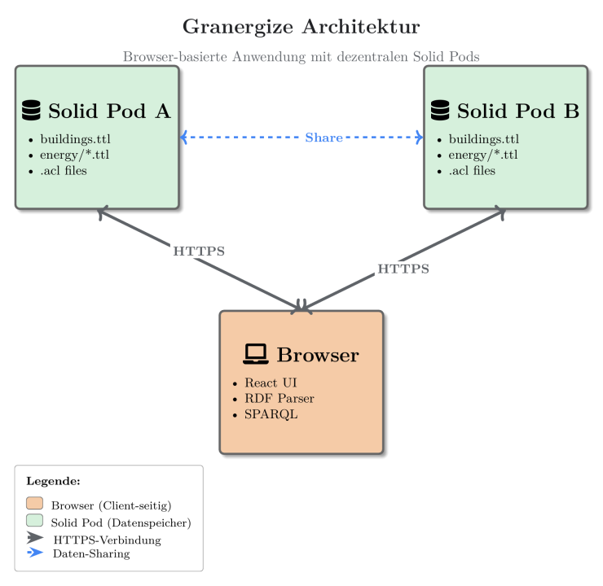{width=85%}

## Datenschutz und sicherer Umgang mit sensiblen Daten

Energieverbrauchsdaten von Logistikimmobilien sind sensible Geschäftsdaten.
Granergize setzt deshalb auf Datensouveränität: Über Solid verbleiben die Daten
im persönlichen Datenspeicher (Solid Pod) des jeweiligen Akteurs. Die Anwendung
hält selbst keine Daten vor, sondern greift erst nach Anmeldung und
ausdrücklicher Einwilligung zu. Wer welche Daten sehen darf, regelt der
Eigentümer über die Zugriffskontrolle des Pods. Freigaben sind gezielt und
jederzeit widerrufbar.

Der aktuelle Demonstrator bietet diese Garantien noch nicht vollständig, da die
Daten auf externen, öffentlich betriebenen Solid-Datenspeichern (z. B.
solidcommunity.net) liegen. Diese stehen nicht unter Kontrolle des Projekts. Für
die Funktionserprobung genügt das, für reale sensible Daten ist es nicht
geeignet.

Für den produktiven Einsatz ist vorgesehen, die Pods auf kontrollierter
Infrastruktur zu betreiben, etwa bei einem Hoster mit Standort in Deutschland
bzw. der EU (z. B. Hetzner) oder auf eigener Infrastruktur, um Datenschutz und
DSGVO-Konformität sicherzustellen. Das Souveränitäts- und Zugriffsmodell bleibt
dabei unverändert, und die Anwendung muss dafür nicht angepasst werden, da sie
unabhängig vom Pod-Anbieter arbeitet.

# Granergize in der Praxis nutzen

## Voraussetzungen

Um Granergize zu nutzen, benötigen Sie lediglich einen aktuellen Webbrowser und
eine Internetverbindung. Die meisten modernen Browser, die sich automatisch
aktualisieren, erfüllen alle technischen Voraussetzungen. Dazu gehören Google
Chrome, Microsoft Edge, Mozilla Firefox und Safari.

Für die Datenspeicherung benötigen Sie einen **Solid Pod**. Das ist Ihr
persönlicher Datenspeicher im Internet – vergleichbar mit einem privaten
Cloud-Speicher, nur dass Sie die vollständige Kontrolle behalten. Im nächsten
Abschnitt erklären wir, wie Sie einen solchen Pod einrichten. Der benötigte
Speicherplatz ist überschaubar: Für ein typisches Logistikgebäude mit
Jahresverbrauchsdaten genügen wenige Kilobyte.

> **Technische Details (für Administratoren)**
>
> - **Browser:** moderne Browser mit ES2020-Unterstützung und Web Crypto API
>   (Chrome/Edge 80+, Firefox 74+, Safari 13.1+); aktiviertes JavaScript; aktive
>   Internetverbindung.
> - **Datenspeicherung:** ein eigener Solid Pod je Nutzer; Speicherbedarf
>   abhängig von der Anzahl der verwalteten Gebäude (Größenordnung einige zehn
>   bis wenige hundert Kilobyte je Gebäude und Jahr).
> - **Lokale Entwicklung/Tests (optional):** Deno 2.x; für
>   Datentransformations-Pipelines Python mit YARRRML/RML.

## Solid Pod einrichten

Bevor Sie Granergize nutzen können, benötigen Sie einen Solid Pod. Einen Pod
einzurichten ist einfach und kostenlos. Für den Einstieg empfehlen wir
[solidcommunity.net](https://solidcommunity.net/) – einen öffentlich
zugänglichen, kostenlosen Service. Später können Sie bei Bedarf einen eigenen
Solid-Server betreiben oder auf einen kommerziellen Anbieter umsteigen (siehe
Abschnitt „Datenschutz").

So erstellen Sie Ihren Solid Pod bei solidcommunity.net:

1. Öffnen Sie [https://solidcommunity.net/](https://solidcommunity.net/) und
   registrieren Sie sich bzw. melden Sie sich an.
2. Wählen Sie **Pod → Create Pod** und vergeben Sie einen Pod-Namen
   (Benutzernamen). Wählen Sie den Namen mit Bedacht, denn er erscheint in der
   Adresse und ist später nur schwer zu ändern.
3. Aus dem Pod-Namen ergibt sich Ihre **WebID** – Ihre digitale Kennung im
   Solid-Ökosystem, z. B.
   `https://maxmustermann.solidcommunity.net/profile/card#me`. Diese WebID ist
   wie eine digitale Ausweisnummer.

**Wichtig:** Notieren Sie sich Ihre WebID. Sie benötigen sie jedes Mal, wenn Sie
sich anmelden, und Sie geben sie an Geschäftspartner weiter, wenn diese Daten mit
Ihnen teilen möchten.

**Die Struktur Ihres Pods:** Ihr Pod enthält u. a. einen Ordner `profile/` mit
Ihrem öffentlichen Profil sowie einen Posteingang (`inbox/`) für
Benachrichtigungen, wenn andere Daten mit Ihnen teilen möchten. Granergize legt
seine eigene Unterstruktur (`granergize/`), in der alle Gebäude-, Energie- und
Freigabedaten organisiert abgelegt werden, automatisch an, sobald Sie das erste
Mal Daten speichern. Um diese Struktur müssen Sie sich nicht kümmern – die
Anwendung übernimmt das für Sie.

## Erste Anmeldung in der Granergize-Anwendung

Nachdem Sie Ihren Solid Pod eingerichtet haben, können Sie sich bei Granergize
anmelden. Die Anwendung ist über Ihren Webbrowser zugänglich – Sie müssen nichts
installieren.

1. Öffnen Sie die Granergize-Webanwendung in Ihrem Browser. Auf der Startseite
   sehen Sie eine kurze Erklärung der Anwendung und einen „Login"-Button.
2. Wählen Sie Ihren Identity Provider – den Dienst, bei dem Ihr Solid Pod liegt.
   Wenn Sie Ihren Pod bei solidcommunity.net erstellt haben, wählen Sie diesen
   aus der Liste oder geben Sie die Adresse `solidcommunity.net` ein.
   Alternativ können Sie auch Ihre vollständige WebID eingeben.
3. Melden Sie sich beim Anbieter an und **bestätigen** Sie, dass Granergize
   Zugriff auf Ihren Pod erhalten darf. Ohne diese Berechtigung kann die
   Anwendung nicht auf Ihre Daten zugreifen oder neue Gebäude speichern. Sie
   können die Berechtigung jederzeit in den Einstellungen Ihres Pods widerrufen.

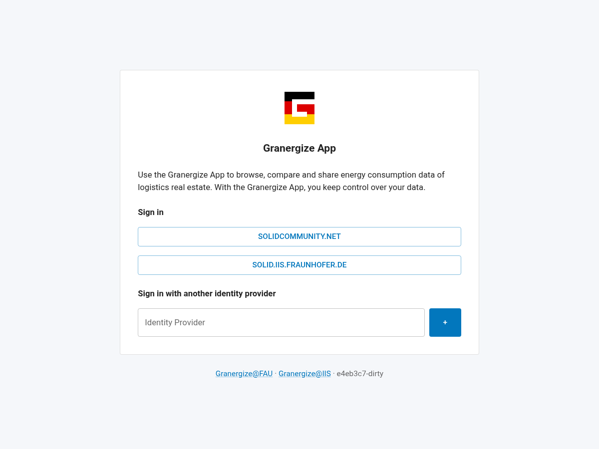{width=100%}

**Was beim ersten Start passiert:** Bei der ersten Anmeldung ist Ihr Dashboard
zunächst leer – es werden keine Daten vorausgesetzt und nichts im Voraus
angelegt. Für einen schnellen Einstieg bietet Ihnen Granergize im Tab **Manage**
an, beispielhafte Demo-Gebäude hinzuzufügen („Add examples"); diesen Hinweis
können Sie auch ausblenden. Die benötigte Ordnerstruktur unter `granergize/`
legt die Anwendung automatisch an, sobald Sie Ihr erstes Gebäude speichern – Sie
müssen sich darum nicht kümmern. Anschließend können Sie eigene Gebäudedaten
hinzufügen und mit der eigentlichen Arbeit beginnen.

## Ihre Rolle als Datenproduzent festlegen

Ihre **Datenproduzenten-Rolle** legen Sie einmalig in Ihrem Profil fest – nicht
bei jeder Dateneingabe. Öffnen Sie dazu über das Avatar-Symbol (oben rechts) den
Dialog **Organisation** und wählen Sie Ihre Rolle. Zur Auswahl stehen alle
Datenproduzenten-Rollen des Immobilienökosystems: **Investor**, **Nutzer**
(Auswahl „User"), **Benchmark Service Provider**, **Facility Manager**,
**Entwickler** (Auswahl „Developer"), **Berater/Makler** (Auswahl „Consultant /
Broker"), **Softwaredienstleister** (Auswahl „Software Provider") und
**Energiedienstleister** (Auswahl „Energy Provider"). Diese Rolle wird
anschließend automatisch als Herkunft (Provenienz) jedes Gebäudes vermerkt, das
Sie anlegen.

Die Rolle bei der Dateneingabe ist damit entkoppelt: Im „Add Building"-Dialog
wählen Sie nur noch die **Vorlage** (das Tabellenformat), nicht mehr die Rolle.

Im selben Dialog **Organisation** hinterlegen Sie zugleich Ihr Unternehmen. Gehen
Sie dazu so vor:

1. **Firmenname eintragen:** Tragen Sie im Feld „Company name" den Namen Ihres
   Unternehmens ein – etwa „Granergize AG".
2. **Art des Unternehmens wählen:** Wählen Sie unter „Kind of company" Ihre
   Datenproduzenten-Rolle (siehe oben).
3. **Firmenlogo hochladen:** Klicken Sie auf „Choose logo…", wählen Sie eine
   Bilddatei aus (PNG, JPG, SVG, WEBP oder GIF). Die Vorschau zeigt sofort das
   gewählte Bild.
4. **Speichern:** Bestätigen Sie mit „Save".

Das Firmenlogo erscheint anschließend als Markierung Ihrer Gebäude auf der Karte
(siehe Abschnitt „Daten ansehen") und steigert so die Wiedererkennbarkeit
gegenüber Geschäftspartnern. Firmenname und Logo werden – wie die Rolle – als
Herkunft Ihrer Gebäudedaten mitgeführt.

## Wie Granergize Gebäudedaten organisiert und sicher freigibt

Sie haben die volle Kontrolle darüber, wer welche Ihrer Gebäudedaten sehen darf.
Granergize baut auf dem Solid-Prinzip auf, das eine klare Trennung vorsieht: Ihre
Identität, Ihre Daten und die Anwendungen, die darauf zugreifen, sind voneinander
unabhängig. Das bedeutet konkret: Ihre Energiedaten gehören Ihnen und liegen auf
Ihrem eigenen Solid Pod – nicht auf einem Server, den andere kontrollieren.

### Zugriffskontrolle über Web Access Control (WAC)

Wenn Sie eine Datei mit einem Kollegen teilen möchten – zum Beispiel ein
Energiezertifikat im PDF-Format oder die Verbrauchsdaten eines Gebäudes – legen
Sie fest, welche Rechte diese Person erhält: nur lesen oder auch ändern. Diese
Berechtigungen werden technisch über Zugriffskontroll-Dateien (Access Control
Lists, ACL) geregelt, die Granergize automatisch im Hintergrund erstellt, wenn
Sie auf „Teilen" klicken.

Stellen Sie sich das wie ein digitales Dokumentenmanagementsystem vor: Jede Datei
in Ihrem Pod kann individuell freigegeben werden. Sie können einem
Geschäftspartner Zugriff auf die Energiedaten von Gebäude A geben, ohne dass
dieser Zugriff auf Gebäude B oder C erhält. Diese granulare Kontrolle ist ein
Kernvorteil des Solid-Ansatzes.

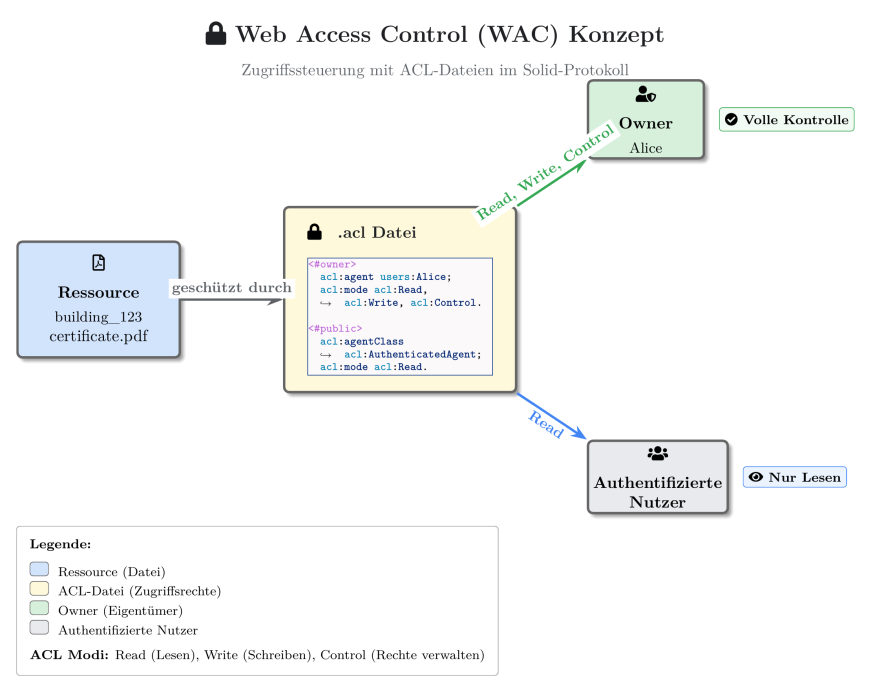{width=85%}

> **Technische Details (für Administratoren)**
>
> Solid (Social Linked Data) basiert auf der Trennung von Identität, Daten und
> Anwendungen. Jede Ressource auf einem Solid Pod kann über eine `.acl`-Datei
> geschützt werden, die definiert, **wer** (`acl:agent`) zugreifen darf und
> **welche Aktionen** (`acl:mode`: Read, Write, Append, Control) erlaubt sind.
> Beispiel – ein Energiezertifikat teilen:
>
> ```turtle
> # Datei: …/building-123-certificate.pdf.acl
> @prefix acl: <http://www.w3.org/ns/auth/acl#> .
>
> <#owner> a acl:Authorization ;
>   acl:agent   <https://alice.solidcommunity.net/profile/card#me> ;
>   acl:accessTo <./building-123-certificate.pdf> ;
>   acl:mode    acl:Read, acl:Write, acl:Control .
>
> <#shared> a acl:Authorization ;
>   acl:agent   <https://bob.solidcommunity.net/profile/card#me> ;
>   acl:accessTo <./building-123-certificate.pdf> ;
>   acl:mode    acl:Read .
> ```

### Die strukturierte Datenbasis

Granergize speichert Ihre Gebäude- und Energiedaten in einer strukturierten Form,
die mehrere Vorteile bietet. Das System nutzt ein Datenmodell, das auf
internationalen Standards basiert – dadurch können Daten aus verschiedenen
Quellen problemlos zusammengeführt werden, und andere Anwendungen können Ihre
Daten ebenfalls lesen, falls Sie das wünschen.

Granergize trennt grundsätzlich zwei Arten von Informationen: **statische
Metadaten** (Adresse, Baujahr, Fläche, Nutzungsart) und **Energiemessdaten**
(Strom-, Gas-, Wärme- und Wasserverbrauch pro Jahr). Diese Trennung ist
entscheidend: Die Metadaten eines Gebäudes – wo es steht, wie groß es ist, ob
eine Photovoltaik-Anlage installiert ist – können Sie mit jemandem teilen, ohne
dass dieser die sensiblen Verbrauchswerte sieht. Umgekehrt können Sie jemandem
Zugriff auf die Energiedaten eines bestimmten Jahres geben, ohne ältere Jahre
freizugeben.

Für jedes Gebäude erstellt Granergize eine Hauptdatei mit allen Stammdaten
(geografische Koordinaten für die Karte, Adresse, Flächen, Baujahr, Information
über vorhandene Photovoltaik-Anlagen). Diese Datei verweist auf separate
Energiedateien – für jedes Jahr eine eigene Datei. Jede dieser Dateien kann
individuell freigegeben werden. Wenn Sie einem Geschäftspartner Zugriff geben,
können Sie also präzise steuern: nur Metadaten, nur die Energiedaten eines
bestimmten Jahres oder alles.

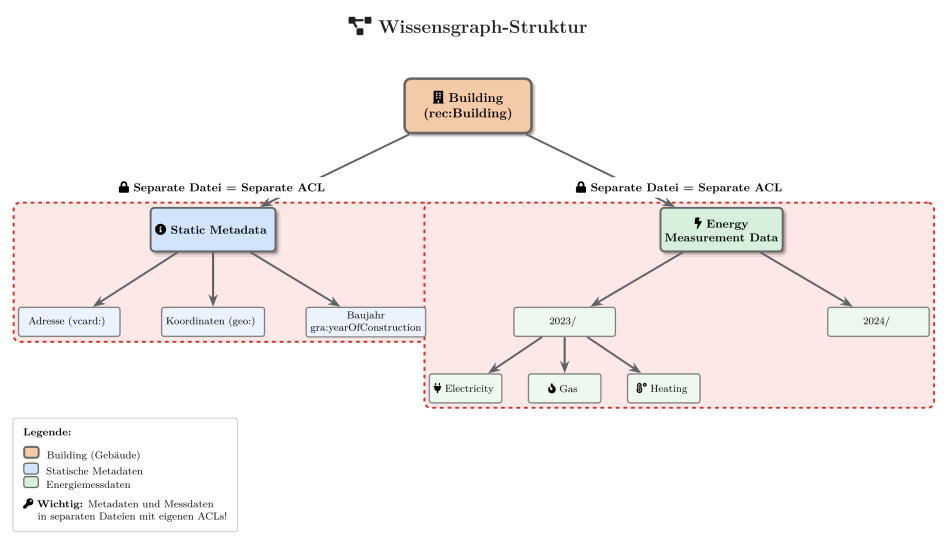{width=75%}

### Verknüpfung mit externem Wissen

Ein weiterer Vorteil der strukturierten Datenbasis: Granergize kann Ihre
Gebäudedaten mit externen Informationsquellen verknüpfen. So lassen sich etwa
Wetterdaten für eine Region heranziehen, um äußere Einflüsse auf den
Energieverbrauch (z. B. über Heizgradtage) einzuordnen, oder internationale
Referenzwerte für eine Gebäudeklassifikation berücksichtigen. In der aktuellen
Anwendung steht hierzu bereits eine Wetterdatenansicht je Gebäude zur Verfügung
(Reiter **Weather data**); die automatische Normalisierung von Verbräuchen anhand
von Wetterdaten ist Gegenstand der Weiterentwicklung.

> **Technische Details (für Administratoren) – verwendete Vokabulare**
>
> Die Granergize-Ontologie kombiniert etablierte Vokabulare mit
> domänenspezifischen Erweiterungen:
>
> - **rec** (`https://w3id.org/rec#`) – Gebäudeklassifikationen, Agenten
> - **sosa** (`http://www.w3.org/ns/sosa/`) – Messwerte
> - **ssn** (`http://www.w3.org/ns/ssn/`) – Messwert-Metadaten, Einheiten
> - **schema** (`http://schema.org/`) – Organisationen, Kunden
> - **vcard** (`http://www.w3.org/2006/vcard/ns#`) – Postadressen
> - **geo** (`http://www.w3.org/2003/01/geo/wgs84_pos#`) – GPS-Koordinaten (WGS84)
> - **xsd** (`http://www.w3.org/2001/XMLSchema#`) – Datentypen (integer, decimal,
>   dateTime …)
> - **gran** (`https://solid.ti.rw.fau.de/gra/vocab.ttl#`) – Granergize-spezifische
>   Erweiterungen

## Gebäude hinzufügen

Im Tab **Manage** unter „Your buildings" stehen zwei Wege zur Verfügung:

- **Add Building:** Ein einzelnes Gebäude über das Formular erfassen (Adresse,
  Koordinaten, Fläche usw.). Über „Get coordinates" können die Koordinaten aus
  der Adresse automatisch ermittelt werden.
- **Autofill from file:** Mehrere Gebäude auf einmal aus einer Excel-Vorlage
  importieren. Die eingelesenen Gebäude können Sie vor dem Speichern prüfen und
  anpassen; fehlende Koordinaten werden beim Import automatisch ergänzt.

Im Dialog wählen Sie zunächst die **Vorlage** (das Tabellenformat). Nachdem Sie
die Felder ausgefüllt bzw. die Datei eingelesen haben, klicken Sie auf „Add
Building". Die eingegebenen Daten werden automatisch in das richtige Format
(RDF) überführt und in Ihrem Solid Pod gespeichert; anschließend erscheint das
Gebäude in der Liste und auf der Karte.

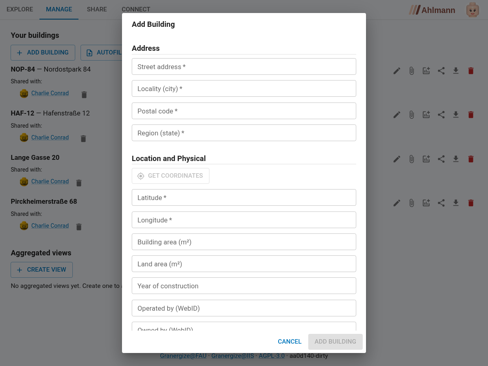{width=100%}

> **Technische Details (für Administratoren)**
>
> Im Hintergrund werden die eingegebenen Daten mit der Granergize-Ontologie
> modelliert und in einen RDF-Graphen überführt. Für jedes Gebäude wird ein
> eindeutiger Name erzeugt; der Graph wird als Turtle-Datei in Ihren Pod
> hochgeladen (Verzeichnis `granergize/buildings/`).

## Gebäude bearbeiten, Dateien verwalten und löschen

Jedes Gebäude in der Liste „Your buildings" (Tab **Manage**) bietet über Symbole
am Zeilenende mehrere Aktionen:

- **Edit building:** Die Stammdaten eines Gebäudes nachträglich ändern oder
  ergänzen (Adresse, Fläche, Baujahr, Nutzungsart usw.).
- **Manage files:** Beliebige Dateien jeden Typs zum Gebäude hinterlegen – etwa
  PDFs, Word-Dokumente, Pläne oder Fotos – sowie herunterladen und wieder löschen.
  Genau eine Datei können Sie über „Set as cert" als **Energieausweis** markieren;
  sie wird dann mit einem entsprechenden Hinweis gekennzeichnet. Angehängte
  Dateien werden automatisch mitgeteilt, wenn Sie das Gebäude teilen, und teilen
  dessen Zugriffsrechte.
- **Download this building's data:** Die Gebäudedaten als Excel-Datei
  herunterladen.
- **Share building data:** Das Gebäude mit Partnern teilen (siehe Kapitel „Daten
  gemeinsam nutzen und Mehrwerte schaffen").
- **Delete building:** Das Gebäude dauerhaft entfernen. Nach einer
  Sicherheitsabfrage werden die Gebäudedatei sowie die zugehörigen Energie- und
  Freigabedaten aus Ihrem Pod gelöscht.

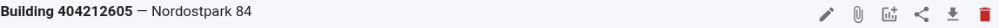{width=100%}

## Energiedaten erfassen und aktualisieren

Energieverbrauchsdaten werden je Gebäude und **Jahr** gepflegt. Öffnen Sie im
Tab **Manage** beim gewünschten Gebäude über das Symbol **„Add / edit energy
year"** das Jahresformular:

- **Jahr erfassen oder aktualisieren:** Wählen Sie ein Jahr und tragen Sie die
  Verbrauchswerte ein. Bereits erfasste Jahre lassen sich jederzeit nachträglich
  ändern oder ergänzen – so halten Sie die Verbrauchsdaten über die Jahre
  aktuell. (Damit ist insbesondere das Hinzufügen neuer Jahresscheiben und das
  spätere Aktualisieren von Verbrauchsdaten möglich.)
- **Soll-Ist-Vergleich:** Erfassen Sie neben den **tatsächlichen** (Ist-)Werten
  auch **geplante** (Soll-)Werte. In der Energieansicht des Gebäudes werden Soll
  und Ist je Jahr nebeneinander dargestellt.

Einen **Energieausweis** hinterlegen Sie als Datei-Anhang des Gebäudes: Laden Sie
ihn unter **„Manage files"** hoch und markieren Sie ihn dort als Energieausweis
(siehe Abschnitt „Gebäude bearbeiten, Dateien verwalten und löschen").

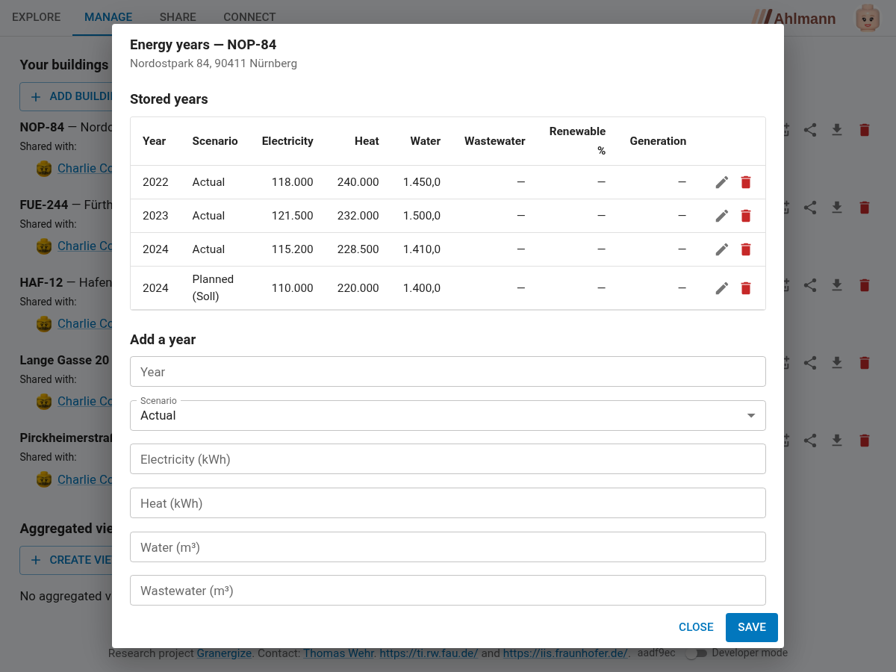{width=100%}

## Daten ansehen

Wählen Sie im Tab **Explore** einen Gebäude-Marker. Jeder Marker zeigt das
Firmenlogo des jeweiligen Datenproduzenten, sofern dieses im Dialog
**Organisation** hinterlegt wurde – andernfalls eine neutrale Standard-Markierung.
Im rechten Bereich wechseln Sie über die Reiter zwischen drei Ansichten:

- **Building data:** die Stammdaten des Gebäudes (Adresse, Fläche, Baujahr,
  Nutzungsart, Photovoltaik usw.). Ist ein Betreiber hinterlegt, wird dessen WebID
  als anklickbarer Verweis auf das jeweilige Profil angezeigt.
- **Energy data:** der Energieverbrauch je Jahr als Diagramm. Haben Sie zu einem
  Jahr sowohl geplante (Soll-) als auch tatsächliche (Ist-)Werte erfasst, werden
  beide **nebeneinander** dargestellt – so erkennen Sie auf einen Blick, wie nah
  der reale Verbrauch am Plan liegt (Soll-Ist-Vergleich). Liegen Verbrauchswerte
  vergleichbarer Gebäude desselben Betreibers vor, wird Ihr Verbrauch zusätzlich
  gegen diesen **Betreiber-Durchschnitt** als Benchmark eingeordnet.
- **Weather data:** die zum Standort passenden Wetterdaten, die zur Einordnung des
  Verbrauchs (z. B. Heizgradtage) herangezogen werden können.

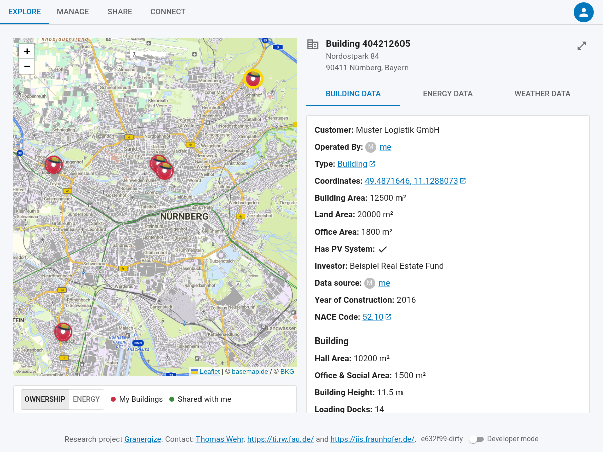{width=100%}

# Daten gemeinsam nutzen und Mehrwerte schaffen

## Möglichkeiten der verschiedenen Datenfreigaben

Das System bietet Ihnen drei verschiedene Wege, Informationen mit Partnern zu
teilen – jeder mit unterschiedlichem Transparenzgrad. Sie können individuelle
Gebäudedaten, aggregierte Ansichten oder rollenbasierte Freigaben nutzen. Die
Wahl der richtigen Freigabe-Option hängt davon ab, mit wem Sie teilen und wie
viel Vertrauen Sie dieser Person entgegenbringen.

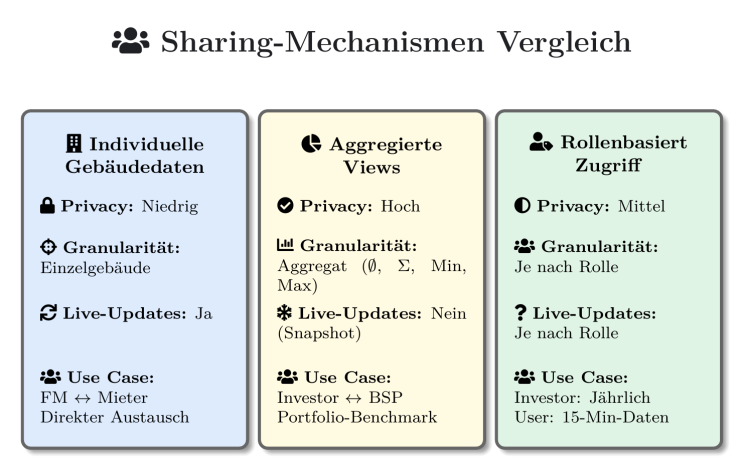{width=90%}

### Individuelle Gebäudedaten teilen

Beim Teilen individueller Gebäudedaten wählen Sie unter „What to share", welchen
Umfang Sie freigeben:

- **Static building data only** – nur die Stammdaten des Gebäudes (Adresse,
  Fläche, Baujahr, Nutzungsart, Information über vorhandene Photovoltaik-Anlagen),
  ohne Verbrauchswerte. Nützlich, wenn Sie jemandem zunächst zeigen möchten,
  welche Gebäude Sie verwalten, ohne sofort sensible Verbrauchsdaten preiszugeben.
- **Static building data and all energy readings** – zusätzlich die
  Verbrauchswerte (Strom, Gas, Fernwärme, Wasser) **aller** Jahre.
- **Static building data and energy for specific year(s)** – nur die
  Verbrauchsdaten der von Ihnen angekreuzten Jahre. Da jedes Jahr als eigene
  Ressource gespeichert ist, können Sie gezielt etwa nur den aktuellsten
  Jahrgang freigeben und ältere zurückhalten.

### Aggregierte Ansichten teilen

Manchmal möchten Sie Informationen teilen, ohne dass der Empfänger Details über
einzelne Gebäude sieht. Zum Beispiel möchte ein Investor wissen, wie effizient
ein Gesamt-Portfolio ist, muss aber nicht wissen, welches spezifische Gebäude wie
viel verbraucht. Für solche Fälle bietet Granergize **aggregierte Ansichten**
(„Views") an: eine Zusammenfassung mehrerer Gebäude. Was der Empfänger erhält,
ist nur diese Zusammenfassung – er sieht nicht, welche Gebäude dahinterstecken.

Granergize bietet vier Aggregationsfunktionen:

- **Durchschnitt (average):** Mittelwert über alle ausgewählten Gebäude.
- **Summe (sum):** addiert alle Werte.
- **Minimum (minimum):** zeigt den niedrigsten Wert.
- **Maximum (maximum):** zeigt den höchsten Wert.

### Rollenbasierte Freigaben

In der Praxis haben unterschiedliche Partner unterschiedliche Bedürfnisse: Ein
Investor benötigt grobe Jahreszahlen, ein Energiemanager hingegen hochauflösende
15-Minuten-Intervalle. Mit der rollenbasierten Freigabe teilen Sie mit allen
Mitgliedern eines Datenraums, die eine bestimmte Rolle innehaben – die Auswahl
der Empfänger ergibt sich aus der Rolle.

## Vorgehensweise beim Datenteilen

### Einem Datenraum beitreten oder einen Raum erstellen

Ein **Datenraum** bündelt die Akteure, die untereinander Daten teilen, und ist
die Grundlage für die rollenbasierte Freigabe. Im Tab **Connect**:

- **Raum erstellen:** „Host a data room" legt einen Raum auf Ihrem Pod an. Teilen
  Sie dessen Link oder QR-Code, damit andere beitreten können.
- **Beitreten:** Fügen Sie eine Raum-URI in das Feld ein und klicken Sie auf
  „Add", oder nutzen Sie „Scan QR code".
- **Rolle wählen:** Weisen Sie sich Ihre Rolle(n) im Raum zu und speichern Sie
  mit „Save roles". Sie können sich dabei bewusst **mehrere oder alle Rollen**
  zuweisen – das ist so vorgesehen. Über diese Rollen können andere gezielt „By
  role" mit Ihnen teilen. (Diese Raum-Rolle ist unabhängig von der
  Datenproduzenten-Rolle aus Ihrem Profil.)

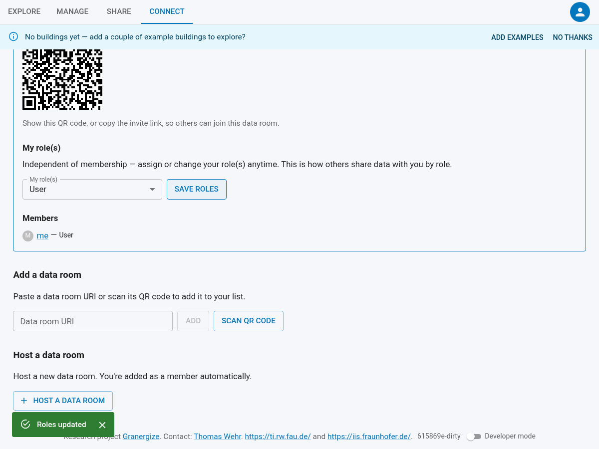{width=100%}

### Kontakte verwalten

Ebenfalls im Tab **Connect** führen Sie unter „Contacts" ein persönliches
Adressbuch Ihrer Geschäftspartner – jeder Eintrag ist eine WebID, zu der
Granergize automatisch den hinterlegten Namen und das Profilbild auflöst.
Geschäftspartner, mit denen Sie Daten teilen, werden hier automatisch gemerkt;
zusätzlich können Sie eine WebID von Hand eintragen und mit „Add" hinzufügen oder
einen Eintrag über das Lösch-Symbol wieder entfernen. Ihre Kontakte erscheinen
anschließend als Vorschläge, wann immer Sie Empfänger für eine Freigabe auswählen
– so müssen Sie eine WebID nicht jedes Mal neu eingeben.

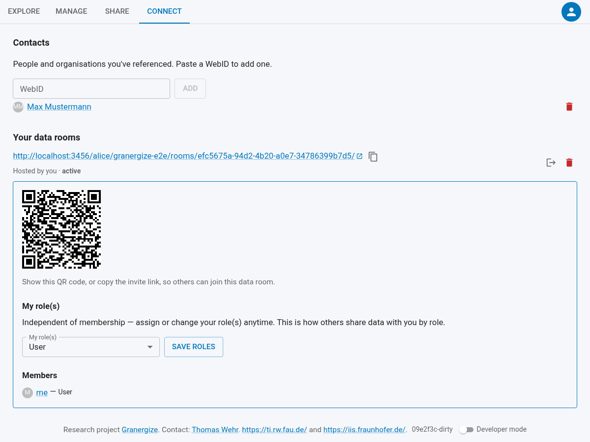{width=100%}

### Ein Gebäude teilen

Im Tab **Manage** hat jedes Gebäude unter „Your buildings" eigene Symbole:
Bearbeiten, Dateien verwalten, Energie-Jahr erfassen, Teilen, Herunterladen und
Löschen (siehe Abschnitt „Gebäude bearbeiten, Dateien verwalten und löschen").

1. Klicken Sie beim gewünschten Gebäude auf das Teilen-Symbol. Der Dialog „Share
   Building Data" öffnet sich.
2. Wählen Sie, an wen geteilt wird: **By WebID** (eine oder mehrere WebIDs
   eingeben) oder **By role** (eine Rolle wählen – geteilt wird mit allen
   Raum-Mitgliedern, die diese Rolle haben).
3. Wählen Sie unter „What to share" den Freigabeumfang – nur Stammdaten, Stammdaten
   mit allen Energiejahren oder Stammdaten mit ausgewählten Jahren (siehe Abschnitt
   „Individuelle Gebäudedaten teilen") – und bestätigen Sie mit **Share**.

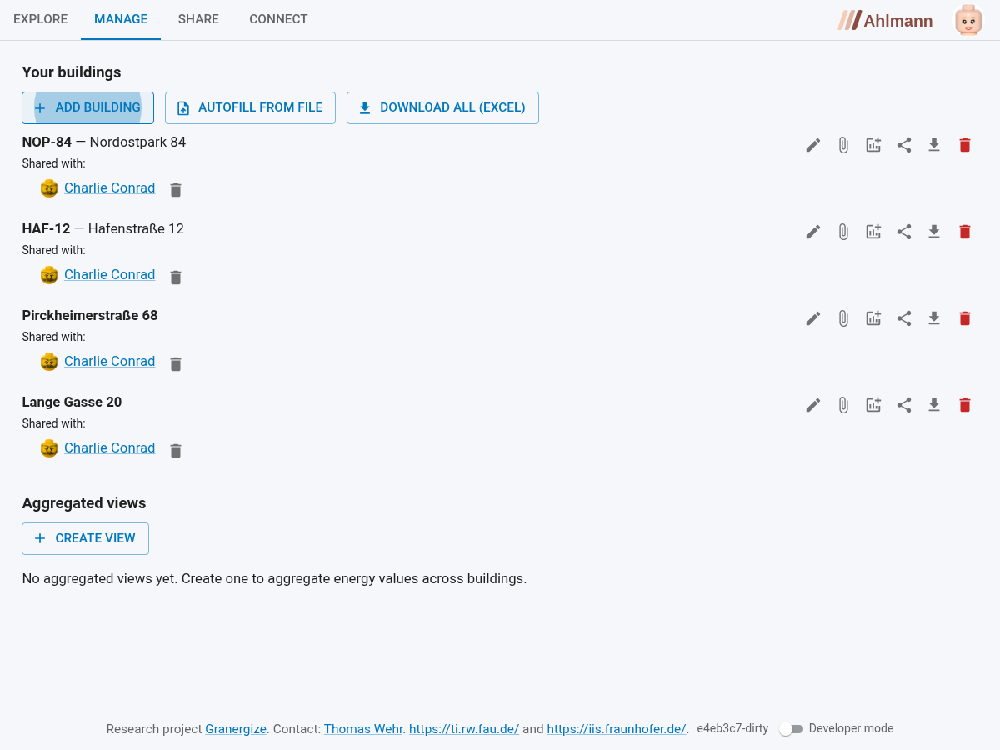{width=100%}

> **Technische Details (für Administratoren)**
>
> Im Hintergrund setzt Granergize die ACL-Berechtigung für die Gebäudedatei
> (und, falls Energiedaten geteilt werden, für die betreffenden Energiedateien),
> sendet eine Access-Grant-Benachrichtigung an den Posteingang (`inbox/`) des
> Empfängers und vermerkt die Freigabe im eigenen Pod. Der Empfänger verarbeitet
> die Benachrichtigung und sieht anschließend die geteilten Daten.

### Aggregierte Ansicht erstellen und teilen

1. Wechseln Sie im Tab **Manage** zum Abschnitt „Aggregated views" und klicken
   Sie auf „Create View".
2. Geben Sie einen Namen ein, wählen Sie die zu aggregierenden Gebäude und
   Kennzahlen sowie die Aggregatsfunktion und erstellen Sie die Ansicht.
3. Teilen Sie die fertige Ansicht über das Teilen-Symbol mit der WebID des
   Empfängers.

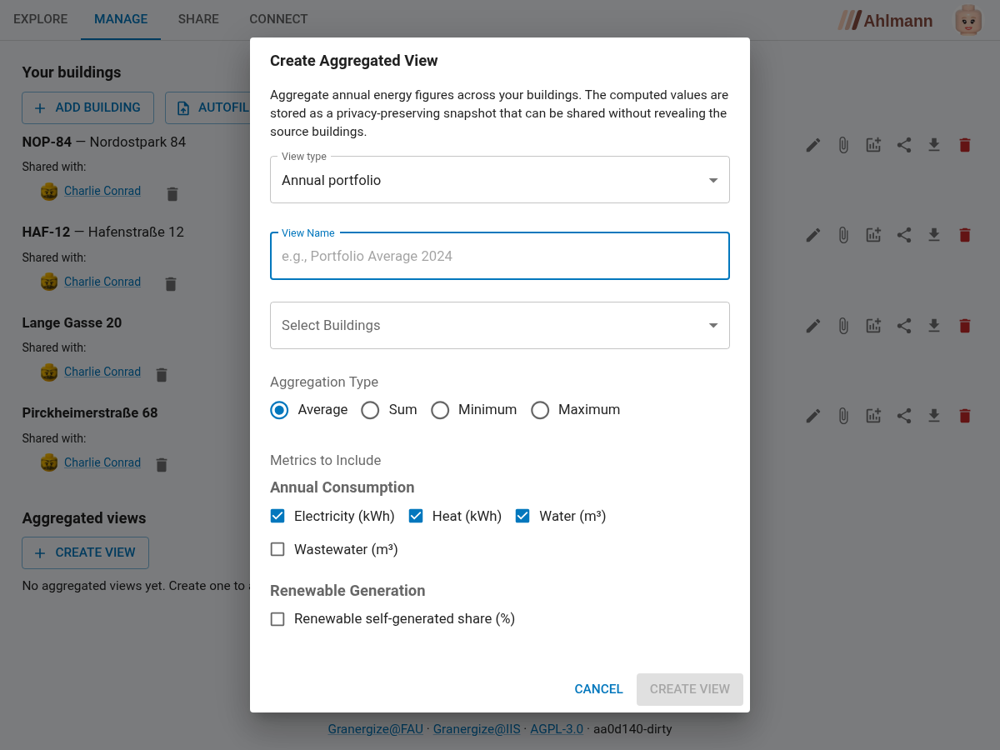{width=80%}

> **Technische Details (für Administratoren)**
>
> Die View-Definition wird in Ihrem Pod gespeichert; die Energiedaten der
> ausgewählten Gebäude werden gelesen und die Aggregation berechnet. Geteilt wird
> ein Snapshot der berechneten Werte – ohne die zugrunde liegenden Gebäude-URIs,
> sodass die Einzelgebäude nicht offengelegt werden.

### Mit Ihnen geteilte Daten

Gebäude, die andere mit Ihnen geteilt haben, finden Sie im Tab **Share** unter
„Buildings shared with you". Sie erscheinen zusätzlich auf der Karte im Tab
**Explore**, sodass Sie sie gemeinsam mit Ihren eigenen Gebäuden auswerten
können. Aggregierte Ansichten, die andere mit Ihnen geteilt haben, finden Sie
ebenda unter „Views shared with you".

Über das Augen-Symbol können Sie ein mit Ihnen geteiltes Gebäude bei Bedarf aus
Ihrer eigenen Karten- und Listenansicht ausblenden und später wieder einblenden.
Das betrifft nur Ihre persönliche Ansicht – die Freigabe selbst bleibt davon
unberührt.

### Zugriff widerrufen

Eine erteilte Freigabe können Sie jederzeit zurücknehmen: Entfernen Sie beim
jeweiligen Gebäude (bzw. bei der Ansicht) unter „Shared with:" den Empfänger über
das Lösch-Symbol. Der Empfänger wird benachrichtigt; beim nächsten Abruf
verschwindet das Gebäude bzw. die Ansicht aus seiner Liste der mit ihm geteilten
Daten.

> **Technische Details (für Administratoren)**
>
> Beim Widerruf wird der ACL-Eintrag entfernt und der Widerruf im eigenen Pod
> vermerkt. Zusätzlich wird eine Benachrichtigung an den Posteingang des
> Empfängers gesendet; beim nächsten Abruf entfernt dessen Anwendung den Eintrag
> aus der Liste der geteilten Daten. (In einer früheren Version erhielt der
> Empfänger keine Benachrichtigung – dies ist nun behoben.)

# Was steckt hinter Granergize

Die in diesem Handbuch beschriebene Webanwendung entstand im Rahmen des
Forschungsprojekts **Granergize – Graphenbasierter Datenraum für
energieeffiziente Logistikimmobilien**. Ziel des Projekts ist es, die Transparenz
und Vergleichbarkeit energierelevanter Daten in Logistikimmobilien zu verbessern
und dadurch die Grundlage für ein effizienteres Energiemanagement zu schaffen. Im
Mittelpunkt steht der Aufbau eines semantischen Datenmodells einschließlich einer
Domänen-Ontologie. Auf dieser Grundlage wird ein Wissensgraph entwickelt, der
unterschiedliche Datenquellen zusammenführt und in einheitlicher Form nutzbar
macht. Dadurch sollen energetische Informationen konsistent ausgewertet und
sowohl unternehmensintern als auch -übergreifend bereitgestellt werden können.
Die entwickelte Webanwendung dient dabei als zentrale Benutzeroberfläche für den
Zugriff auf die im Wissensgraphen verwalteten Daten.

Granergize ist ein Projekt der Industriellen Gemeinschaftsforschung (IGF) und
wird durch das Bundesministerium für Wirtschaft und Energie (BMWE) gefördert
(Förderkennzeichen 01IF23286N). Das Projekt läuft von April 2024 bis Juni 2026
und wird gemeinsam von Partnern aus Wissenschaft und Wirtschaft umgesetzt –
beteiligt sind das Fraunhofer IIS, die Friedrich-Alexander-Universität
Erlangen-Nürnberg sowie einzelne Praxispartner aus dem
Logistikimmobilienökosystem.

# Literaturverzeichnis

[1] A. Nehm, U. Veres-Homm, C. Kille (2009). *Logistikimmobilien in Deutschland:
Markt und Standorte; eine Studie mit der Unterstützung von Deka Immobilien,
Goldbeck, ING Real Estate, Jones Lang LaSalle, ProLogis.* Fraunhofer-Verlag,
Stuttgart.

[2] Statistisches Bundesamt (2023). *Daten zur Energiepreisentwicklung, Lange
Reihen von Januar 2005 bis Dezember 2022.* Wiesbaden.

[3] European Commission (2022). *EU taxonomy for sustainable activities.* URL:
<https://finance.ec.europa.eu/sustainable-finance/tools-and-standards/eu-taxonomy-sustainable-activities_en>
