<!--
  QUELLE DES PRAXISHANDBUCHS — diese Markdown-Datei ist die maßgebliche Quelle.
  PDF + DOCX werden daraus erzeugt:  deno task handbuch
  App-Screenshots liegen unter docs/figures/ (erzeugt von e2e/screenshots.spec.ts);
  die konzeptionellen Abbildungen (Architektur, WAC, Wissensgraph, Sharing-
  Vergleich) wurden aus dem ursprünglichen Handbuch übernommen.
  Abschnitte mit der Überschrift „Technische Details" richten sich an technische
  Anwender und Administratoren und können beim Lesen übersprungen werden.
-->

# Was dieses Praxishandbuch leistet und für wen es gedacht ist

Dieses Praxishandbuch bietet eine anwendungsorientierte Einführung in die
Konzeption und Nutzung der Granergize-App – einer Webanwendung, die einen
Wissensgraphen für Energieverbrauchsdaten von Logistikimmobilien nutzbar macht.
Ziel ist es, heterogene Datenquellen zu integrieren, semantisch zu
harmonisieren und für Analyse-, Benchmarking- und Entscheidungsprozesse nutzbar
zu machen.

Vor dem Hintergrund von Datensilos, uneinheitlichen Datenformaten und
unterschiedlichen Anforderungen der beteiligten Akteure zeigt das Handbuch
praxisnah, wie ein semantisches Datenschema einschließlich Ontologie die
Transparenz, Interoperabilität und Vergleichbarkeit von Energieverbrauchsdaten
verbessern kann. Gleichzeitig wird erläutert, wie ein sicherer, kontrollierter
und flexibler Datenaustausch innerhalb des Immobilienökosystems ermöglicht wird.

Darüber hinaus schafft das Handbuch die Grundlage für datengetriebene
Optimierungsansätze zur Steigerung der Energieeffizienz sowie zur Unterstützung
regulatorischer Anforderungen, insbesondere im Bereich Nachhaltigkeit und
CO~2~-Bilanzierung.

Die Zielgruppe umfasst alle Akteure des Logistikimmobilienökosystems,
insbesondere Nutzer und Eigentümer von Logistikimmobilien, Investoren, Facility
Manager, Makler, Berater sowie Software-, Energie- und Benchmark-Dienstleister.
Es richtet sich gleichermaßen an fachliche wie technische Anwender und verbindet
fachliche Grundlagen mit praxisnaher Anwendung.

# Vom Problem zur Lösung: Energieverbrauchsdaten nutzbar machen

## Warum Energieverbrauchsdaten bislang nur eingeschränkt zugänglich sind

Energieverbrauchsdaten von Logistikimmobilien liegen häufig in Datensilos und
sind in der Praxis nur schwer zugänglich. Das komplexe Ökosystem verstärkt diese
Problematik: Die unterschiedlichen Akteure verwenden eigene Systeme,
verschiedene Datenformate und Modelle. Verbrauchsdaten liegen daher in
variierenden Strukturen, Granularitäten und Zeitauflösungen vor. Diese
Heterogenität erschwert das Teilen von Daten; Datenaustausch und Vergleichbarkeit
sind bislang nur eingeschränkt gegeben.

Gleichzeitig bilden Logistikimmobilien zentrale Knotenpunkte logistischer
Netzwerke und übernehmen eine entscheidende Rolle bei der Erbringung logistischer
Dienstleistungen. Vor dem Hintergrund steigender Strom- und Gaspreise sowie
wachsender regulatorischer Anforderungen, insbesondere im Kontext von
Nachhaltigkeit und CO~2~-Bilanzierung durch konkrete EU-Taxonomien, gewinnt die
Energieeffizienz von Logistikimmobilien zunehmend an Bedeutung.

Dennoch bestehen erhebliche Herausforderungen: Die komplexe Akteurslandschaft mit
unterschiedlichen Perspektiven auf den Energieverbrauch erschwert den Zugang zu
entscheidenden Daten. Die Mobilisierung dieser Daten innerhalb der Unternehmen
erfordert zudem hohen manuellen Aufwand. Auch die Vielfalt der Gebäudetypen und
unterschiedliche Nutzungsregimes erschweren die Vergleichbarkeit der jeweiligen
Informationen.

## Der Wissensgraph als Schlüssel

Wissensgraphen bieten die geeignete technologische Grundlage, um diesen
Herausforderungen zu begegnen. Sie ermöglichen es, heterogene Daten aus
unterschiedlichen Quellen in einem einheitlichen, semantisch beschriebenen
Modell zusammenzuführen, ohne dass bestehende Systeme vollständig vereinheitlicht
werden müssen. Durch die explizite Modellierung von Entitäten (z. B. Gebäude
oder Zähler) und deren Beziehungen können Daten zudem nicht nur integriert,
sondern auch in den Kontext gesetzt und damit besser interpretiert werden.

Daher wird dieser Ansatz im Projekt Granergize aufgegriffen und ein einheitliches
Datenmodell entwickelt. Damit wird eine gemeinsame semantische Grundlage
etabliert, die einen sicheren und kontrollierten Datenaustausch im gesamten
Immobilienökosystem ermöglicht. Gleichzeitig wird die Voraussetzung für internes
sowie externes Benchmarking geschaffen, ohne die Datenhoheit der einzelnen
Beteiligten einzuschränken: Innerhalb des Ökosystems kann demnach jeder Akteur
selbst bestimmen, mit wem er welche Daten in welcher Granularität und Frequenz
teilen möchte.

Damit bilden Wissensgraphen eine zentrale Brücke zwischen der aktuell heterogenen
Datenlandschaft und einer zukunftsfähigen, datengetriebenen Steuerung von
Energieeffizienz in Logistikimmobilien.

## Praxisbeispiele: Use Cases für die Anwendung

Drei Anwendungsfälle haben die Entwicklung der Granergize-App geleitet. Jeder
wird hier zunächst fachlich beschrieben; wo die App ihn einlöst, nennt der
jeweilige Abschnitt – und die betreffenden Stellen im praktischen Teil dieses
Handbuchs greifen den Anwendungsfall namentlich wieder auf. Die Reihenfolge
folgt der Zahl der Beteiligten: Der Soll-Ist-Vergleich spielt sich im eigenen
Bestand ab, die Vertriebsoptimierung lebt vom Teilen zwischen zwei Parteien,
und das Energieverbrauchsbenchmark bringt mit dem Benchmark-Dienstleister
einen dritten Akteur ins Spiel. Am Ende des praktischen Teils läuft jeder der
drei noch einmal als durchgehender Ablauf ab (Kapitel „Die Anwendungsfälle
durchgespielt").

Durch das gesamte Handbuch begleitet dabei ein festes Beispiel-Ensemble aus
drei Personen mit ihren Firmen:

- {height=2.4em}
  {height=1.6em}
  **A — Alice Ahlmann** von der **Ahlmann Logistik GmbH**, einer Logistikfirma,
  die ihre eigenen Hallen nutzt. Im Soll-Ist-Vergleich agiert sie allein; in
  den beiden anderen Anwendungsfällen ist sie die Bestandshalterin, die ihre
  Daten teilt.
- {height=2.4em}
  {height=1.6em}
  **B — Bob Bauer** von **Bauer Grundbesitz**, ein Geschäftspartner von A — je
  nach Anwendungsfall Investor, Makler oder Berater, der geteilte Daten
  einsieht, und im Benchmark selbst Bestandshalter.
- {height=2.4em}
  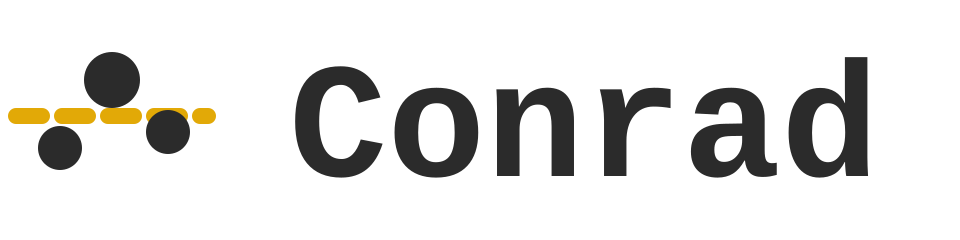{height=1.6em}
  **C — Charlie Conrad** von der **Conrad Kennwert GmbH**, ein
  Benchmark-Dienstleister (Benchmark Service Provider), der die Gebäude von A
  und B vergleichbar macht.

Alle Bildschirmfotos dieses Handbuchs zeigen diese drei: Avatar und Firmenlogo
erscheinen in der App in der Kopfzeile und an den Gebäude-Markern auf der
Karte, sodass in jedem Bild erkennbar ist, wessen Sicht gerade gezeigt wird.

### Soll-Ist-Vergleich

Ein zentraler Anwendungsfall ist die Durchführung von
Soll-Ist-Vergleichen. Dabei werden tatsächliche Energieverbräuche systematisch
den geplanten, erwarteten oder referenzierten Werten gegenübergestellt und
miteinander verglichen. So können Abweichungen frühzeitig erkannt und die
energetische Performance des Gebäudes fundiert bewertet werden. Als Referenzwerte
dienen u. a. Energiebedarfs- oder Verbrauchsausweise oder Verbrauchsprognosen,
z. B. auf Basis des definierten Nutzungsregimes oder der vorgegebenen
Raumtemperatur. Zudem können erwartete Einsparungen aus Investitionsmaßnahmen wie
Umrüstungen auf LED oder KNX-basierte Gebäudeautomation überprüft werden. Dieser
Soll-Ist-Vergleich ermöglicht es, die Wirksamkeit technischer und
organisatorischer Maßnahmen nachvollziehbar zu überprüfen und den erzielten
Return on Investment zu belegen. Voraussetzung sind belastbare Soll-Verbrauchs-
und Betriebsdaten sowie die jeweiligen granularen Ist-Daten; ergänzend werden
Wetterdaten benötigt, um äußere Einflüsse zu berücksichtigen. Besonders relevant
für Nutzer, Gebäudetechnikausstatter, Investoren, Facility Manager und
Projektentwickler.

Die Granergize-App unterstützt diesen Anwendungsfall direkt: Zu jedem Gebäude und Jahr
können neben den Ist-Werten auch geplante (Soll-)Werte erfasst und in der
Energieansicht nebeneinander dargestellt werden (siehe Abschnitt „Energiedaten
erfassen und aktualisieren"). Dafür genügt der eigene Pod – weitere Beteiligte
sind nicht erforderlich. Den durchgehenden Ablauf zeigt der Abschnitt
„Soll-Ist-Vergleich durchgespielt" im Kapitel „Die Anwendungsfälle
durchgespielt".

### Vertriebsoptimierung

Ein weiterer relevanter Anwendungsfall ist die Unterstützung vertrieblicher
Prozesse auf Basis energiebezogener Gebäude- und Standortdaten. Ziel ist es,
Logistik- und Gewerbeobjekte systematisch zu verorten sowie hinsichtlich ihrer
energetischen Eigenschaften zu visualisieren. Eine visuelle Kategorisierung
anhand des Energieverbrauchs erleichtert die Einordnung der jeweiligen
Logistikimmobilie in ihr Wettbewerbsumfeld. So kann hervorgehoben werden, dass
eine Immobilie im Vergleich zu benachbarten Hallen besonders energieeffizient
ist. Die bereitgestellten Informationen unterstützen Investoren und Makler bei
der Vermarktung von Immobilien und fördern die Zusammenarbeit zwischen Beratern,
Facility Managern und Nutzern. Für diesen Anwendungsfall werden vor allem
aggregierte Verbrauchsdaten sowie allgemeine Objektdaten benötigt.

In der Granergize-App übernimmt das die Energie-Linse der Karte: Sie färbt die
Gebäude-Marker nach Energieintensität ein und ordnet ein Objekt so auf einen
Blick in sein sichtbares Umfeld ein – einschließlich der Gebäude, die andere
mit Ihnen geteilt haben (siehe Abschnitt „Gebäude nach Energieverbrauch
einordnen"). Ihre volle Wirkung entfaltet die Linse damit erst im Zusammenspiel
mit dem Teilen: Je mehr Eigentümer einem Makler oder Berater ihre Gebäude
einschließlich Energiedaten freigeben, desto vollständiger wird dessen
Marktüberblick. Wie eine solche Freigabe abläuft und beim Empfänger auf der
Karte landet, führt der Abschnitt „Vertriebsoptimierung durchgespielt" im
Kapitel „Die Anwendungsfälle durchgespielt" aus.

### Energieverbrauchsbenchmark

Das systematische Benchmarking von Energieverbräuchen bildet den dritten
Anwendungsfall. Ziel ist es, Energieverbräuche auf Objektebene transparent und
vergleichbar zu machen, um einzelne Immobilien innerhalb eines geeigneten
Vergleichsfeldes (z. B. nach Nutzungsart, Größe oder Betriebsprofil) einordnen
zu können. Auf diese Weise können besonders effiziente oder ineffiziente Objekte
identifiziert und fundierte Bewertungen der energetischen Performance vorgenommen
werden. Liegen zusätzlich detaillierte Messdaten vor, können darüber hinaus
Optimierungspotenziale erkannt und konkrete Verbesserungsmaßnahmen abgeleitet
werden. Für die Umsetzung werden insbesondere Objekt-, Nutzungs- sowie
Verbrauchsdaten benötigt, sowohl in aggregierter als auch in detaillierter Form.
Besonders relevant ist dieser Use Case für Nutzer, Investoren bzw.
Bestandshalter, Facility Manager und spezialisierte Benchmarking-Anbieter.

Die Granergize-App löst diesen Anwendungsfall auf zwei Ebenen ein: Innerhalb
des eigenen Bestands stellt die Energie-Detailseite jeden Verbrauchswert dem
Portfolio- und dem Betreiber-Durchschnitt gegenüber (siehe Abschnitt
„Energie-Detailseite eines Gebäudes"). Über den eigenen Bestand hinaus kommt
der Vergleichswert von einem Benchmark-Dienstleister – in der App die Rolle
„Benchmark Service Provider" –, der über die Gebäude mehrerer Eigentümer
aggregiert; das vollständige Zusammenspiel führt der Abschnitt
„Energieverbrauchsbenchmark durchgespielt" im Kapitel „Die Anwendungsfälle
durchgespielt" aus.

# Sicherer Umgang mit Energieverbrauchsdaten im Immobilienökosystem

## Daten sicher steuern und teilen

Die Granergize-App ist eine moderne Webanwendung, die Ihnen hilft,
Energieverbrauchsdaten Ihrer Logistikimmobilien zu verwalten und mit anderen
Akteuren zu teilen. Was die App besonders macht: Sie behalten die volle
Kontrolle über Ihre Daten. Im Gegensatz zu herkömmlichen Cloud-Plattformen, bei
denen Ihre Daten auf fremden Servern liegen, speichert die Granergize-App **nichts
zentral**.

Die Anwendung läuft komplett in Ihrem Webbrowser – Sie benötigen keine
Installation und keine lokale Software. Ihre Daten liegen sicher auf Ihrem
eigenen **Solid Pod**, einem persönlichen Datenspeicher im Internet, den nur Sie
kontrollieren. Die Anwendung greift nur mit Ihrer ausdrücklichen Erlaubnis auf
diese Daten zu, und Sie entscheiden jederzeit, welche Informationen Sie mit
Kollegen, Mietern oder Geschäftspartnern teilen möchten.

**Das Kernprinzip:** Ihre Daten gehören Ihnen, liegen auf Ihrem Solid Pod, und
die Anwendung holt sie nur bei Bedarf ab – vollständige Datensouveränität ohne
zentrale Datenbank oder Backend-Server, die gehackt werden könnten oder denen Sie
vertrauen müssten.

### Architektur im Überblick

Die Granergize-App läuft in Ihrem Browser und ruft Ihre Daten aus Ihrem persönlichen
Solid Pod ab. Möchten Sie mit Kollegen zusammenarbeiten, geben Sie diesen gezielt
Zugriff auf bestimmte Teile Ihres Pods – die Daten bleiben aber immer in Ihrem
Besitz. Wenn Sie sich anmelden, verbindet sich die Anwendung über eine sichere
Verbindung (HTTPS) mit Ihrem Solid Pod und zeigt Ihre Gebäude- und Energiedaten
an. Teilen Sie Daten mit einem Geschäftspartner, erteilen Sie diesem eine
Leseberechtigung für bestimmte Dateien auf Ihrem Pod. Der Partner ruft die Daten
dann direkt von Ihrem Pod ab – sie fließen niemals über einen zentralen Server,
den jemand anderes kontrolliert.

{width=85%}

## Datenschutz und sicherer Umgang mit sensiblen Daten

Energieverbrauchsdaten von Logistikimmobilien sind sensible Geschäftsdaten.
Die Granergize-App setzt deshalb auf Datensouveränität: Über Solid verbleiben die Daten
im persönlichen Datenspeicher (Solid Pod) des jeweiligen Akteurs. Die Anwendung
hält selbst keine Daten vor, sondern greift erst nach Anmeldung und
ausdrücklicher Einwilligung zu. Wer welche Daten sehen darf, regelt der
Eigentümer über die Zugriffskontrolle des Pods. Freigaben sind gezielt und
jederzeit widerrufbar.

Der aktuelle Demonstrator bietet diese Garantien noch nicht vollständig, da die
Daten auf externen, öffentlich betriebenen Solid-Datenspeichern (z. B.
solidcommunity.net) liegen. Diese stehen nicht unter Kontrolle des Projekts. Für
die Funktionserprobung genügt das, für reale sensible Daten ist es nicht
geeignet.

Für den produktiven Einsatz ist vorgesehen, die Pods auf kontrollierter
Infrastruktur zu betreiben, etwa bei einem Hoster mit Standort in Deutschland
bzw. der EU (z. B. Hetzner) oder auf eigener Infrastruktur, um Datenschutz und
DSGVO-Konformität sicherzustellen. Das Souveränitäts- und Zugriffsmodell bleibt
dabei unverändert, und die Anwendung muss dafür nicht angepasst werden, da sie
unabhängig vom Pod-Anbieter arbeitet. Wie Sie einen solchen Server selbst
aufsetzen, beschreibt der Abschnitt „Einen eigenen Solid-Server betreiben".

# Die Granergize-App in der Praxis nutzen

## Voraussetzungen

Um die Granergize-App zu nutzen, benötigen Sie lediglich einen aktuellen Webbrowser und
eine Internetverbindung. Die meisten modernen Browser, die sich automatisch
aktualisieren, erfüllen alle technischen Voraussetzungen. Dazu gehören Google
Chrome, Microsoft Edge, Mozilla Firefox und Safari.

Für die Datenspeicherung benötigen Sie einen **Solid Pod**. Das ist Ihr
persönlicher Datenspeicher im Internet – vergleichbar mit einem privaten
Cloud-Speicher, nur dass Sie die vollständige Kontrolle behalten. Im nächsten
Abschnitt erklären wir, wie Sie einen solchen Pod einrichten. Der benötigte
Speicherplatz ist überschaubar: Für ein typisches Logistikgebäude mit
Jahresverbrauchsdaten genügen wenige Kilobyte.

> **Technische Details (für Administratoren)**
>
> - **Browser:** moderne Browser mit ES2020-Unterstützung und Web Crypto API
>   (Chrome/Edge 80+, Firefox 74+, Safari 13.1+); aktiviertes JavaScript; aktive
>   Internetverbindung.
> - **Datenspeicherung:** ein eigener Solid Pod je Nutzer; Speicherbedarf
>   abhängig von der Anzahl der verwalteten Gebäude (Größenordnung einige zehn
>   bis wenige hundert Kilobyte je Gebäude und Jahr).
> - **Lokale Entwicklung/Tests (optional):** Deno 2.x; für
>   Datentransformations-Pipelines Python mit YARRRML/RML.

## Solid Pod einrichten

Bevor Sie die Granergize-App nutzen können, benötigen Sie einen Solid Pod. Einen Pod
einzurichten ist einfach und kostenlos. Für den Einstieg empfehlen wir
[solidcommunity.net](https://solidcommunity.net/) – einen öffentlich
zugänglichen, kostenlosen Service. Später können Sie bei Bedarf einen eigenen
Solid-Server betreiben (siehe Abschnitt „Einen eigenen Solid-Server betreiben")
oder auf einen kommerziellen Anbieter umsteigen; die Hintergründe erläutert der
Abschnitt „Datenschutz".

So erstellen Sie Ihren Solid Pod bei solidcommunity.net:

1. Öffnen Sie [https://solidcommunity.net/](https://solidcommunity.net/) und
   registrieren Sie sich bzw. melden Sie sich an.
2. Wählen Sie **Pod → Create Pod** und vergeben Sie einen Pod-Namen
   (Benutzernamen). Wählen Sie den Namen mit Bedacht, denn er erscheint in der
   Adresse und ist später nur schwer zu ändern.
3. Aus dem Pod-Namen ergibt sich Ihre **WebID** – Ihre digitale Kennung im
   Solid-Ökosystem, z. B.
   `https://maxmustermann.solidcommunity.net/profile/card#me`. Diese WebID ist
   wie eine digitale Ausweisnummer.

Ein Dienst wie solidcommunity.net übernimmt dabei zwei getrennte Rollen: Er ist
Ihr **Identity Provider** – er verwaltet Ihre WebID und bestätigt beim Anmelden,
dass Sie deren Inhaber sind – und zugleich Ihr **Speicheranbieter**, der Ihren
Pod beherbergt. Diese Rollen müssen nicht beim selben Anbieter liegen: Ihr
WebID-Profil verweist auf Ihren Speicherort, sodass Ihre Identität nicht an
einen bestimmten Datenspeicher gebunden ist. In diesem Handbuch gehen wir vom
üblichen Fall aus, dass beides aus einer Hand kommt.

**Wichtig:** Notieren Sie sich Ihre WebID. Sie benötigen sie jedes Mal, wenn Sie
sich anmelden, und Sie geben sie an Geschäftspartner weiter, wenn diese Daten mit
Ihnen teilen möchten.

**Die Struktur Ihres Pods:** Ihr Pod enthält u. a. einen Ordner `profile/` mit
Ihrem öffentlichen Profil sowie einen Posteingang (`inbox/`) für
Benachrichtigungen, wenn andere Daten mit Ihnen teilen möchten. Die Granergize-App legt
seine eigene Unterstruktur (`granergize/`), in der alle Gebäude-, Energie- und
Freigabedaten organisiert abgelegt werden, automatisch an, sobald Sie das erste
Mal Daten speichern. Um diese Struktur müssen Sie sich nicht kümmern – die
Anwendung übernimmt das für Sie.

## Einen eigenen Solid-Server betreiben (für Administratoren)

Für die Funktionserprobung genügt ein öffentlicher Dienst wie
solidcommunity.net. Sobald reale, sensible Daten ins Spiel kommen, sollten die
Pods dagegen auf Infrastruktur liegen, die Sie selbst kontrollieren (siehe
Abschnitt „Datenschutz"). Da die Granergize-App unabhängig vom Pod-Anbieter arbeitet,
brauchen Sie dafür nur einen spezifikationskonformen Solid-Server – an der
Anwendung selbst ändert sich nichts, und auch die Bedienung bleibt identisch:
Bei der Anmeldung geben Sie statt solidcommunity.net einfach die Adresse Ihres
eigenen Servers als Identity Provider ein. Ein so betriebener Server übernimmt
– wie solidcommunity.net – beide Rollen zugleich: Er ist Identity Provider und
Speicheranbieter für die Pods, die auf ihm liegen (siehe Abschnitt „Solid Pod
einrichten").

Wir empfehlen den [Community Solid
Server](https://communitysolidserver.github.io/CommunitySolidServer/) (CSS) –
eine quelloffene, frei verfügbare Server-Implementierung, die vom
Solid-Projekt gepflegt wird. Die Granergize-App wird fortlaufend automatisiert gegen
den Community Solid Server (Version 7) getestet, von der Datenschicht bis zur
Browser-Oberfläche; diese Kombination ist damit gut abgesichert.

**Ausprobieren auf dem eigenen Rechner:** Sie benötigen lediglich
[Node.js](https://nodejs.org/) (Version 18 oder neuer). Ein einziger Befehl
startet den Server:

```
npx @solid/community-server@7 -p 3000 -b http://localhost:3000/ -f ./solid-daten
```

Die drei Optionen bedeuten:

- `-p` – der Port, auf dem der Server erreichbar ist.
- `-b` – die Basis-Adresse des Servers. Sie wird Bestandteil aller WebIDs und
  Pod-Adressen, die auf diesem Server entstehen.
- `-f` – das Verzeichnis, in dem die Daten als Dateien abgelegt werden. Ohne
  diese Option hält der Server alle Daten nur im Arbeitsspeicher – nach einem
  Neustart wäre alles verloren.

Öffnen Sie anschließend `http://localhost:3000/` im Browser, legen Sie dort ein
Konto und einen Pod an (der Ablauf entspricht dem im Abschnitt „Solid Pod
einrichten" beschriebenen), und melden Sie sich in der Granergize-App mit
`http://localhost:3000` als Identity Provider an.

**Produktiver Betrieb:** Für den Dauerbetrieb auf einem eigenen Server kommen
einige Punkte hinzu:

- **Verschlüsselung (HTTPS):** Betreiben Sie den Server hinter einem Reverse
  Proxy (z. B. nginx oder Caddy), der TLS-Zertifikate bereitstellt. Browser
  lassen die Solid-Anmeldung außerhalb des eigenen Rechners nur über
  verschlüsselte Verbindungen zu. Die Option `-b` muss dabei auf die
  öffentliche `https://`-Adresse zeigen.
- **Basis-Adresse mit Bedacht wählen:** Wie der Pod-Name ist auch die
  Server-Adresse später nur schwer zu ändern – sie steckt in jeder WebID und
  in allen gespeicherten Verweisen. Wählen Sie also von Anfang an die
  endgültige Domain.
- **Als Dienst betreiben:** Richten Sie den Server als Systemdienst (z. B.
  systemd) ein oder nutzen Sie das offizielle Docker-Image
  `solidproject/community-server`; in beiden Fällen geben Sie dieselben
  Optionen `-b` und `-f` an.
- **Datensicherung:** Das mit `-f` gewählte Verzeichnis enthält alle Pods als
  gewöhnliche Dateien. Eine regelmäßige Sicherung dieses Verzeichnisses
  genügt als Backup.
- **Benutzerverwaltung:** Neue Nutzer registrieren sich selbst über die
  Startseite des Servers. Alternativ können Sie Konten und Pods beim
  Serverstart über die Option `--seedConfig` (eine JSON-Datei mit
  Kontenliste) vorab anlegen.

**Auch die Anwendung selbst können Sie betreiben:** Die Granergize-App
ist quelloffen
(siehe Abschnitt „Was steckt hinter Granergize"); der Quellcode liegt auf GitHub
unter
[github.com/wintechis/granergize-webapp](https://github.com/wintechis/granergize-webapp).
Die Anwendung läuft vollständig im Browser und hat kein eigenes Backend:
`deno task build` erzeugt einen statischen Build (`dist/`), den jeder
gewöhnliche Webserver ausliefern kann – etwa derselbe Reverse Proxy, hinter dem
Ihr Solid-Server läuft. Damit liegen alle drei Bausteine – Identität, Speicher
und Anwendung – auf Infrastruktur, die Sie selbst kontrollieren.

> **Hinweis:** Auch andere spezifikationskonforme Solid-Server und
> kommerzielle Anbieter funktionieren mit der Granergize-App – sie ist an
> keinen Anbieter gebunden. Der Community Solid Server ist lediglich die vom
> Projekt am intensivsten erprobte Variante.

## Erste Anmeldung in der Granergize-App

Nachdem Sie Ihren Solid Pod eingerichtet haben, können Sie sich bei der
Granergize-App anmelden. Die Anwendung ist über Ihren Webbrowser zugänglich – Sie müssen nichts
installieren.

1. Öffnen Sie die Granergize-App in Ihrem Browser. Auf der Startseite
   sehen Sie eine kurze Erklärung der Anwendung und einen „Login"-Button.
2. Wählen Sie Ihren Identity Provider – den Dienst, der Ihre WebID verwaltet
   und beim Anmelden bestätigt, dass Sie deren Inhaber sind (in der Regel
   derselbe Dienst, bei dem auch Ihr Pod liegt). Wenn Sie Ihren Pod bei
   solidcommunity.net erstellt haben, wählen Sie diesen
   aus der Liste oder geben Sie die Adresse `solidcommunity.net` ein.
   Alternativ können Sie auch Ihre vollständige WebID eingeben.
3. Melden Sie sich beim Identity Provider an und **bestätigen** Sie, dass die
   Granergize-App Zugriff auf Ihren Pod erhalten darf. Ohne diese Berechtigung kann die
   Anwendung nicht auf Ihre Daten zugreifen oder neue Gebäude speichern. Sie
   können die Berechtigung jederzeit in den Einstellungen Ihres Pods widerrufen.

> **Hinweis:** Läuft Ihre Anmeldung nach längerer Nutzung ab, zeigt die
> Anwendung einmalig den Hinweis „Session expired – please log in again" und
> meldet Sie ab. Melden Sie sich danach einfach erneut an – Ihre Daten sind
> davon nicht betroffen.

{width=100%}

**Was beim ersten Start passiert:** Bei der ersten Anmeldung ist Ihr Dashboard
zunächst leer – es werden keine Daten vorausgesetzt und nichts im Voraus
angelegt. Für einen schnellen Einstieg bietet Ihnen die Granergize-App an, **vier
beispielhafte Demo-Gebäude** hinzuzufügen („Add examples"); diesen Hinweis
können Sie auch ausblenden. Er erscheint nur, solange Sie weder eigene noch
mit Ihnen geteilte Gebäude haben; schlägt das Anlegen einzelner Beispiele fehl
(etwa durch eine instabile Verbindung), meldet die Anwendung, wie viele der
vier Gebäude angelegt wurden, und das Angebot bleibt zum erneuten Versuch
verfügbar. Die Beispiele decken beide Datenformen ab – zwei
Gebäude mit Jahreswerten (2022–2024) und vollständigen Stammdaten, zwei mit
15-Minuten-Messreihen (eines davon trägt zusätzlich Jahreswerte). Zwei der
Gebäude mit Jahreswerten teilen sich denselben Betreiber und eines enthält
zusätzlich geplante (Soll-)Werte, sodass Betreiber-Durchschnitt und
Soll-Ist-Vergleich direkt an den Beispieldaten sichtbar sind. Die Abbildungen in diesem Handbuch zeigen genau diese
Demo-Gebäude. Die benötigte Ordnerstruktur unter `granergize/`
legt die Anwendung automatisch an, sobald Sie Ihr erstes Gebäude speichern – Sie
müssen sich darum nicht kümmern. Anschließend können Sie eigene Gebäudedaten
hinzufügen und mit der eigentlichen Arbeit beginnen.

## Ihre Organisation festlegen

Bevor Sie Gebäude anlegen, hinterlegen Sie einmalig Ihre **Organisation** – Ihr
Unternehmen samt Logo. Diese Angaben gelten danach für alle Gebäude, die Sie
erfassen; Sie müssen sie nicht bei jeder Dateneingabe wiederholen. Öffnen Sie über
das Avatar-Symbol (oben rechts) den Dialog **Organisation** und füllen Sie die
Felder aus:

1. **Firmenname** („Company name"): der Name Ihres Unternehmens – etwa
   „Granergize AG".
2. **Firmenlogo** („Choose logo…"): wählen Sie eine Bilddatei (PNG, JPG, SVG, WEBP
   oder GIF); die Vorschau zeigt das Bild sofort.
3. **Homepage** („Homepage URI", optional): die Website Ihres Unternehmens.
4. **Organisations-WebID** („Organisation WebID", optional): besitzt Ihr
   Unternehmen eine eigene WebID, verknüpfen Sie sie hier.
5. **Speichern:** Bestätigen Sie mit „Save".

Sie müssen **keine Rolle** festlegen, um Gebäude anzulegen: Jedes Gebäude und seine
Energiedaten werden ohne Rollenzuordnung erfasst, lediglich mit Ihrer WebID als
Datenproduzent vermerkt. Rollen kommen ausschließlich in **Datenräumen** zum Einsatz
(siehe „Rollenbasierte Freigaben"). Der „Add Building"-Dialog zeigt für alle Gebäude
dieselbe, einheitliche Eingabemaske.

Das Firmenlogo erscheint anschließend als Markierung Ihrer Gebäude auf der Karte
(siehe Abschnitt „Daten ansehen") und steigert so die Wiedererkennbarkeit
gegenüber Geschäftspartnern.

> **Hinweis:** Ihr persönlicher **Anzeigename** und Ihr Profilbild stammen aus
> Ihrem Solid-WebID-Profil (Teil Ihrer Identität, gepflegt bei Ihrem Identity
> Provider), nicht aus diesem
> Dialog. Ist dort ein Name hinterlegt, erscheint er überall dort, wo die
> Granergize-App Sie als Person ausweist – etwa als Absender einer Freigabe.

## Wie die Granergize-App Gebäudedaten organisiert und sicher freigibt

Sie haben die volle Kontrolle darüber, wer welche Ihrer Gebäudedaten sehen darf.
Die Granergize-App baut auf dem Solid-Prinzip auf, das eine klare Trennung vorsieht: Ihre
Identität, Ihre Daten und die Anwendungen, die darauf zugreifen, sind voneinander
unabhängig. Das bedeutet konkret: Ihre **Identität** ist Ihre WebID samt Profil –
sie weist Sie aus, unabhängig davon, wo Ihre Daten liegen. Ihre **Daten** gehören
Ihnen und liegen auf Ihrem eigenen Solid Pod – nicht auf einem Server, den andere
kontrollieren. Und die **Anwendung** ist austauschbar: die Granergize-App ist eine von
beliebig vielen Anwendungen, die – jeweils nur mit Ihrer Erlaubnis – auf dieselben
Daten zugreifen können; keiner der drei Bausteine bindet Sie an die anderen.
Die Anwendung selbst ist quelloffen und kann wie Identität und Speicher auf
eigener Infrastruktur betrieben werden (siehe Abschnitt „Was steckt hinter
Granergize").

### Zugriffskontrolle über Web Access Control (WAC)

Wenn Sie eine Datei mit einem Kollegen teilen möchten – zum Beispiel ein
Energiezertifikat im PDF-Format oder die Verbrauchsdaten eines Gebäudes – legen
Sie fest, welche Rechte diese Person erhält: nur lesen oder auch ändern. Diese
Berechtigungen werden technisch über Zugriffskontroll-Dateien (Access Control
Lists, ACL) geregelt, die die App automatisch im Hintergrund erstellt, wenn
Sie auf „Teilen" klicken.

Stellen Sie sich das wie ein digitales Dokumentenmanagementsystem vor: Jede Datei
in Ihrem Pod kann individuell freigegeben werden. Sie können einem
Geschäftspartner Zugriff auf die Energiedaten von Gebäude A geben, ohne dass
dieser Zugriff auf Gebäude B oder C erhält. Diese granulare Kontrolle ist ein
Kernvorteil des Solid-Ansatzes.

{width=85%}

> **Technische Details (für Administratoren)**
>
> Solid (Social Linked Data) basiert auf der Trennung von Identität, Daten und
> Anwendungen. Jede Ressource auf einem Solid Pod kann über eine `.acl`-Datei
> geschützt werden, die definiert, **wer** (`acl:agent`) zugreifen darf und
> **welche Aktionen** (`acl:mode`: Read, Write, Append, Control) erlaubt sind.
> Beispiel – ein Energiezertifikat teilen:
>
> ```turtle
> # Datei: …/building-123-certificate.pdf.acl
> @prefix acl: <http://www.w3.org/ns/auth/acl#> .
>
> <#owner> a acl:Authorization ;
>   acl:agent   <https://alice.solidcommunity.net/profile/card#me> ;
>   acl:accessTo <./building-123-certificate.pdf> ;
>   acl:mode    acl:Read, acl:Write, acl:Control .
>
> <#shared> a acl:Authorization ;
>   acl:agent   <https://bob.solidcommunity.net/profile/card#me> ;
>   acl:accessTo <./building-123-certificate.pdf> ;
>   acl:mode    acl:Read .
> ```

### Die strukturierte Datenbasis

Die Granergize-App speichert Ihre Gebäude- und Energiedaten in einer strukturierten Form,
die mehrere Vorteile bietet. Das System nutzt ein Datenmodell, das auf
internationalen Standards basiert – dadurch können Daten aus verschiedenen
Quellen problemlos zusammengeführt werden, und andere Anwendungen können Ihre
Daten ebenfalls lesen, falls Sie das wünschen.

Die App trennt grundsätzlich zwei Arten von Informationen: **statische
Metadaten** (Adresse, Baujahr, Fläche, Nutzungsart) und **Energiemessdaten**
(Strom-, Gas-, Wärme- und Wasserverbrauch pro Jahr). Diese Trennung ist
entscheidend: Die Metadaten eines Gebäudes – wo es steht, wie groß es ist, ob
eine Photovoltaik-Anlage installiert ist – können Sie mit jemandem teilen, ohne
dass dieser die sensiblen Verbrauchswerte sieht. Umgekehrt können Sie jemandem
Zugriff auf die Energiedaten eines bestimmten Jahres geben, ohne ältere Jahre
freizugeben.

Für jedes Gebäude erstellt die App eine Hauptdatei mit allen Stammdaten
(geografische Koordinaten für die Karte, Adresse, Flächen, Baujahr, Information
über vorhandene Photovoltaik-Anlagen). Diese Datei verweist auf separate
Energiedateien – für jedes Jahr eine eigene Datei. Jede dieser Dateien kann
individuell freigegeben werden. Wenn Sie einem Geschäftspartner Zugriff geben,
können Sie also präzise steuern: nur Metadaten, nur die Energiedaten eines
bestimmten Jahres oder alles.

{width=75%}

### Verknüpfung mit externem Wissen

Ein weiterer Vorteil der strukturierten Datenbasis: die App kann Ihre
Gebäudedaten mit externen Informationsquellen verknüpfen. So lassen sich etwa
Wetterdaten für eine Region heranziehen, um äußere Einflüsse auf den
Energieverbrauch (z. B. über Heizgradtage) einzuordnen, oder internationale
Referenzwerte für eine Gebäudeklassifikation berücksichtigen. In der aktuellen
Anwendung steht hierzu bereits eine Wetterdatenansicht je Gebäude zur Verfügung
(Reiter **Weather data**); die automatische Normalisierung von Verbräuchen anhand
von Wetterdaten ist Gegenstand der Weiterentwicklung.

> **Technische Details (für Administratoren) – verwendete Vokabulare**
>
> Die Granergize-Ontologie kombiniert etablierte Vokabulare mit
> domänenspezifischen Erweiterungen:
>
> - **rec** (`https://w3id.org/rec#`) – Gebäudeklassifikationen, Agenten
> - **sosa** (`http://www.w3.org/ns/sosa/`) – Messwerte
> - **ssn** (`http://www.w3.org/ns/ssn/`) – Messwert-Metadaten, Einheiten
> - **schema** (`http://schema.org/`) – Organisationen, Kunden
> - **vcard** (`http://www.w3.org/2006/vcard/ns#`) – Postadressen
> - **geo** (`http://www.w3.org/2003/01/geo/wgs84_pos#`) – GPS-Koordinaten (WGS84)
> - **xsd** (`http://www.w3.org/2001/XMLSchema#`) – Datentypen (integer, decimal,
>   dateTime …)
> - **gran** (`https://solid.ti.rw.fau.de/gra/vocab.ttl#`) – Granergize-spezifische
>   Erweiterungen

## Gebäude hinzufügen

Im Tab **Manage** bündelt eine Aktionsleiste über der Liste „Your buildings"
alle Aktionen, die den Bestand betreffen. Zum Erfassen stehen zwei Wege zur
Verfügung:

- **Add Building:** Ein einzelnes Gebäude über das Formular erfassen (Adresse,
  Koordinaten, Fläche usw.). Für alle Gebäude erscheint dieselbe, einheitliche
  Eingabemaske – es gibt keine Rollen- oder Vorlagenauswahl mehr. Über „Get
  coordinates" können die Koordinaten aus der Adresse automatisch ermittelt werden.
- **Autofill from file:** Mehrere Gebäude auf einmal aus einer Excel-Datei
  einlesen. Das Tabellenformat wird beim Hochladen **automatisch erkannt** (bei
  Bedarf über „File format" manuell überschreibbar); enthält die Datei auch
  Energiedaten, werden diese mit übernommen – sowohl **Jahreswerte** als auch
  **15-Minuten-Lastgänge** (das Hochladen einer langen Messreihe lässt sich
  jederzeit abbrechen). Die eingelesenen Gebäude können Sie vor
  dem Speichern prüfen und anpassen; fehlende Koordinaten werden automatisch ergänzt.

Daneben bietet die Aktionsleiste **„Download all (Excel)"**: Damit laden Sie
alle eigenen Gebäude samt ihrer Jahreswerte in eine gemeinsame Excel-Datei
herunter – etwa zur Weitergabe oder als Sicherung.

Ein gesondertes Template wird **nicht benötigt**: Laden Sie ein vorhandenes
Gebäude über „Download this building's data" als Excel-Datei herunter – diese
Datei lässt sich (auch ausgefüllt mit eigenen Werten) über „Autofill from file"
wieder einlesen und dient damit zugleich als Vorlage. Für einen schnellen Start
eignen sich dazu auch die Demo-Gebäude („Add examples").

Nachdem Sie die Felder ausgefüllt bzw. die Datei eingelesen haben, klicken Sie auf
„Add Building". Die eingegebenen Daten werden automatisch in das richtige Format
(RDF) überführt und in Ihrem Solid Pod gespeichert; anschließend erscheint das
Gebäude in der Liste und auf der Karte.

{width=100%}

> **Technische Details (für Administratoren)**
>
> Im Hintergrund werden die eingegebenen Daten mit der Granergize-Ontologie
> modelliert und in einen RDF-Graphen überführt. Für jedes Gebäude wird ein
> eindeutiger Name erzeugt; der Graph wird als Turtle-Datei in Ihren Pod
> hochgeladen (Verzeichnis `granergize/buildings/`).

## Gebäude bearbeiten, Dateien verwalten und löschen

Jedes Gebäude in der Liste „Your buildings" (Tab **Manage**) bietet über Symbole
am Zeilenende mehrere Aktionen:

- **Edit building:** Die Stammdaten eines Gebäudes nachträglich ändern oder
  ergänzen (Adresse, Fläche, Baujahr, Nutzungsart usw.).
- **Manage files:** Beliebige Dateien jeden Typs zum Gebäude hinterlegen – etwa
  PDFs, Word-Dokumente, Pläne oder Fotos – sowie herunterladen und wieder löschen.
  Genau eine Datei können Sie über „Set as cert" als **Energieausweis** markieren;
  sie wird dann mit einem entsprechenden Hinweis gekennzeichnet. Angehängte
  Dateien werden automatisch mitgeteilt, wenn Sie das Gebäude teilen, und teilen
  dessen Zugriffsrechte.
- **Download this building's data:** Die Gebäudedaten als Excel-Datei
  herunterladen; dabei wählen Sie das gewünschte Tabellenformat (Zeilen-Layout,
  Tabelle oder generisch).
- **Share building data:** Das Gebäude mit Partnern teilen (siehe Kapitel „Daten
  gemeinsam nutzen und Mehrwerte schaffen").
- **Delete building:** Das Gebäude dauerhaft entfernen. Nach einer
  Sicherheitsabfrage werden die Gebäudedatei sowie die zugehörigen Energie- und
  Freigabedaten aus Ihrem Pod gelöscht.

{width=100%}

## Energiedaten erfassen und aktualisieren

Energieverbrauchsdaten werden je Gebäude und **Jahr** gepflegt. Öffnen Sie im
Tab **Manage** beim gewünschten Gebäude über das Symbol **„Add / edit energy
year"** den Dialog. Die Kopfzeile des Dialogs nennt **Name und Anschrift des
Gebäudes**, sodass Sie beim Wechsel zwischen mehreren Gebäuden stets sehen,
wessen Daten Sie gerade bearbeiten. Oben listet die Tabelle **„Stored years"**
alle bereits erfassten Jahre mit ihren Werten auf – so sehen Sie auf einen
Blick, was gespeichert ist; darunter steht das Eingabeformular.

- **Jahr erfassen:** Wählen Sie ein Jahr und tragen Sie die Verbrauchswerte ein.
  Nach dem Speichern bleibt der Dialog geöffnet, und das neue Jahr erscheint
  sofort in der Tabelle.
- **Jahr aktualisieren oder löschen:** Über die Schaltflächen je Tabellenzeile
  laden Sie ein gespeichertes Jahr zum **Bearbeiten** zurück ins Formular – die
  vorhandenen Werte werden vorbefüllt, sodass das Ergänzen einzelner Kennzahlen
  die übrigen nicht überschreibt – oder **löschen** es. So halten Sie die
  Verbrauchsdaten über die Jahre aktuell.
- **Soll-Ist-Vergleich:** Erfassen Sie neben den **tatsächlichen** (Ist-)Werten
  auch **geplante** (Soll-)Werte. In der Energieansicht des Gebäudes werden Soll
  und Ist je Jahr nebeneinander dargestellt.

Einen **Energieausweis** hinterlegen Sie als Datei-Anhang des Gebäudes: Laden Sie
ihn unter **„Manage files"** hoch und markieren Sie ihn dort als Energieausweis
(siehe Abschnitt „Gebäude bearbeiten, Dateien verwalten und löschen").

{width=100%}

## Daten ansehen

Wählen Sie im Tab **Explore** einen Gebäude-Marker. Jeder Marker zeigt das
Firmenlogo des jeweiligen Datenproduzenten, sofern dieses im Dialog
**Organisation** hinterlegt wurde – andernfalls eine neutrale Standard-Markierung.
Im rechten Bereich wechseln Sie über die Reiter zwischen drei Ansichten:

- **Building data:** die Stammdaten des Gebäudes (Adresse, Fläche, Baujahr,
  Nutzungsart, Photovoltaik usw.). Ist ein Betreiber hinterlegt, wird dessen WebID
  als anklickbarer Verweis auf das jeweilige Profil angezeigt.
- **Energy data:** der Energieverbrauch je Jahr – zunächst als
  **Übersichtstabelle** mit den Jahreswerten, darunter als Diagramm. Haben Sie zu
  einem Jahr sowohl geplante (Soll-) als auch tatsächliche (Ist-)Werte erfasst, werden
  beide **nebeneinander** dargestellt – so erkennen Sie auf einen Blick, wie nah
  der reale Verbrauch am Plan liegt (Soll-Ist-Vergleich). Gibt es **mindestens ein
  weiteres Gebäude mit demselben Betreiber** (Feld „Operated by") und
  Verbrauchsdaten, erscheint in der Übersichtstabelle zusätzlich die Zeile
  **„Operator average"** – der **Betreiber-Durchschnitt** als Benchmark. In den
  Durchschnitt geht jedes Gebäude mit seinem **aktuellsten Ist-Jahr** ein; die
  Jahre müssen also nicht übereinstimmen. Maßgeblich ist allein der eingetragene
  Betreiber, nicht etwa gleiche Fläche oder gleiches Baujahr – ohne ein zweites
  Gebäude desselben Betreibers mit Daten zur jeweiligen Kennzahl erscheint kein
  Benchmark. Trägt ein Gebäude statt Jahreswerten eine **15-Minuten-Messreihe**
  (z. B. aus einem Lastgang-Import), zeigt dieser Reiter stattdessen
  Zeitreihen-Diagramme: Tagessummen und ein durchschnittliches Tagesprofil.
  Trägt ein Gebäude **beides** – Jahreswerte und Messreihe –, schalten Sie über
  den Umschalter **Annual | Time series** zwischen den Darstellungen um (so
  z. B. beim Beispielgebäude Lange Gasse 20).
- **Weather data:** die zum Standort passenden Wetterdaten, die zur Einordnung des
  Verbrauchs (z. B. Heizgradtage) herangezogen werden können.

{width=100%}

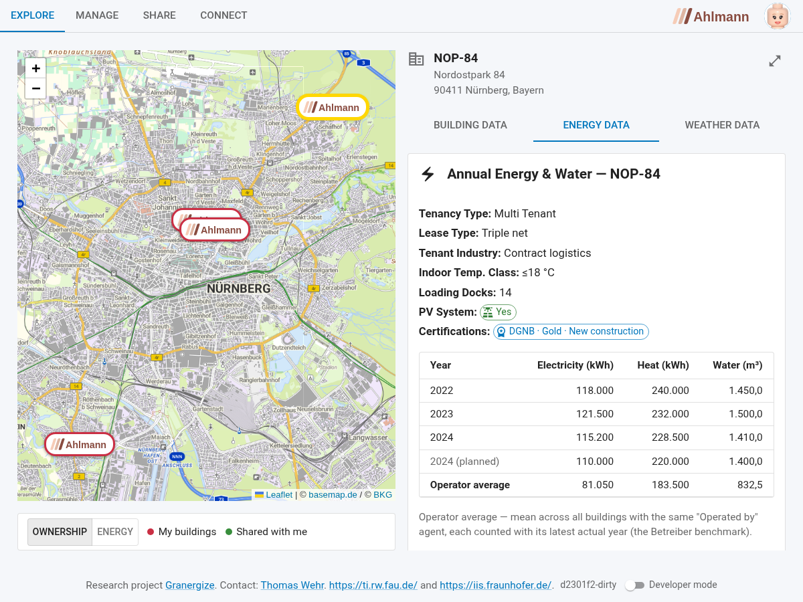{width=100%}

### Energie-Detailseite eines Gebäudes (Direktaufruf)

Zu jedem Gebäude gibt es zusätzlich eine eigenständige Energie-Detailseite, die
Sie direkt über die Adresszeile des Browsers aufrufen und als **Lesezeichen**
ablegen können: `…/#/energy/<Gebäude-Referenz>`. Die Gebäude-Referenz ist der
technische Bezeichner des Gebäudes – ein Verweis auf seine Datei im Pod, in der
Adresszeile URL-kodiert. Am einfachsten kopieren Sie die Adresse direkt aus der
Adresszeile, statt sie von Hand zu bilden.
Die Seite zeigt die Kennzahlen des **aktuellsten erfassten Jahres**
als Tabelle und stellt jedem Wert bis zu drei Vergleichswerte gegenüber:

- **Portfolio average** – der Durchschnitt über Ihre eigenen Gebäude.
- **Operator average** – der Betreiber-Durchschnitt (siehe oben): Gebäude
  desselben Betreibers, jedes mit seinem aktuellsten Ist-Jahr.
- **Benchmark** – ein extern berechneter Vergleichswert, den ein
  Benchmark-Dienstleister als aggregierte Ansicht mit Ihnen geteilt hat.

Der eigene Wert wird farblich eingeordnet – grün, wenn er unter dem
Vergleichswert liegt, rot darüber; je größer die Abweichung, desto kräftiger die
Färbung. Als Maßstab dient dabei der **spezifischste verfügbare Vergleich**: der
externe Benchmark vor dem Betreiber-Durchschnitt vor dem Portfolio-Durchschnitt.
Damit vereint diese Seite die drei Vergleichsperspektiven – eigenes Portfolio,
Betreiber, externer Benchmark – in einer Ansicht: Hier löst die App den
eingangs beschriebenen Anwendungsfall „Energieverbrauchsbenchmark" für das
einzelne Gebäude ein. Woher der externe Benchmark kommt, zeigt der Abschnitt
„Energieverbrauchsbenchmark durchgespielt" im Kapitel „Die Anwendungsfälle
durchgespielt".

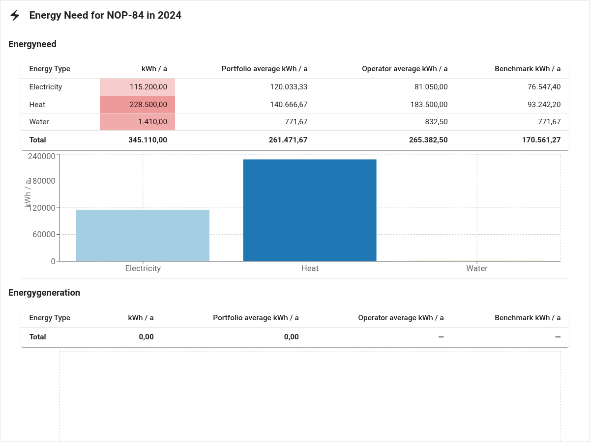{width=100%}

## Gebäude nach Energieverbrauch einordnen (Energie-Linse)

Die Karte im Tab **Explore** kann die Gebäude-Marker auf zwei Arten einfärben.
Über den Umschalter unten an der Karte wählen Sie die **Linse**:

- **Ownership** (Voreinstellung): unterscheidet farblich nur Ihre **eigenen**
  Gebäude von solchen, die **andere mit Ihnen geteilt** haben.
- **Energy:** färbt jeden Marker nach dem **Energieverbrauch** ein – von „More
  efficient" über „Typical" bis „Less efficient"; Gebäude ohne auswertbare
  Energiedaten bleiben neutral („No energy data"). Damit setzt die Karte den
  Anwendungsfall „Vertriebsoptimierung" um: Ein Objekt ist auf einen Blick als
  energieeffizienter oder -ineffizienter als seine Nachbarn erkennbar.

Die Einordnung erfolgt nach der **Energieintensität** (Verbrauch je m² Fläche,
kWh/m²/a), nicht nach dem absoluten Verbrauch – so wird eine große, effiziente
Halle nicht schlechter bewertet als ein kleiner, ineffizienter Bau. Maßgeblich
ist der **aktuellste** erfasste Jahreswert; die Fläche entnimmt die Anwendung den
Stammdaten (Hallenfläche, ersatzweise Gebäude- oder Bürofläche). Fehlt einem
Gebäude die Fläche oder ein Jahresverbrauch, lässt sich keine Intensität
berechnen, und der Marker bleibt neutral.

Verglichen wird stets gegen die Gebäude, die **gerade im Kartenausschnitt
sichtbar** sind – beim Verschieben oder Zoomen verschiebt sich also auch der
Vergleichsmaßstab. Wichtig für die gemeinsame Nutzung: In diese Einordnung gehen
**auch die mit Ihnen geteilten Gebäude** ein, sofern zu ihnen Energiedaten und
eine Fläche vorliegen. Sie vergleichen damit eigene und fremde Objekte im selben
Wettbewerbsumfeld.

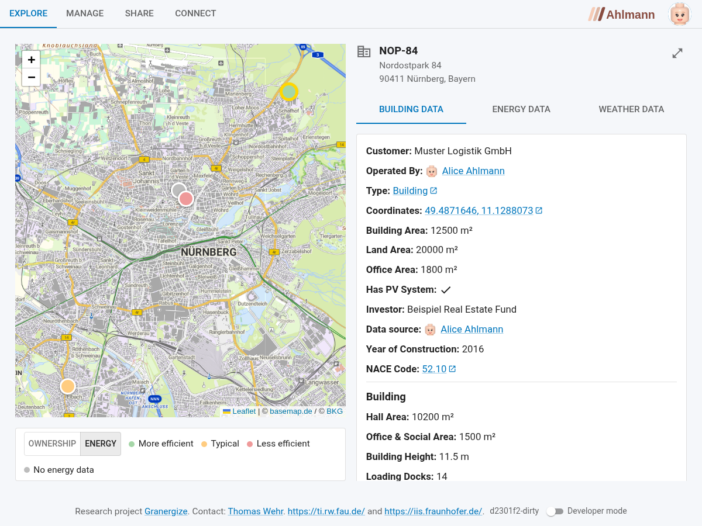{width=100%}

# Daten gemeinsam nutzen und Mehrwerte schaffen

## Möglichkeiten der verschiedenen Datenfreigaben

Das System bietet Ihnen drei verschiedene Wege, Informationen mit Partnern zu
teilen – jeder mit unterschiedlichem Transparenzgrad. Sie können individuelle
Gebäudedaten, aggregierte Ansichten oder rollenbasierte Freigaben nutzen. Die
Wahl der richtigen Freigabe-Option hängt davon ab, mit wem Sie teilen und wie
viel Vertrauen Sie dieser Person entgegenbringen.

{width=90%}

### Individuelle Gebäudedaten teilen

Beim Teilen individueller Gebäudedaten wählen Sie unter „What to share", welchen
Umfang Sie freigeben:

- **Static building data only** – nur die Stammdaten des Gebäudes (Adresse,
  Fläche, Baujahr, Nutzungsart, Information über vorhandene Photovoltaik-Anlagen),
  ohne Verbrauchswerte. Nützlich, wenn Sie jemandem zunächst zeigen möchten,
  welche Gebäude Sie verwalten, ohne sofort sensible Verbrauchsdaten preiszugeben.
- **Static building data and all energy readings** – zusätzlich die
  Verbrauchswerte (Strom, Gas, Fernwärme, Wasser) **aller** Jahre. Diese
  Freigabe umfasst auch Jahre, die Sie erst **nach** dem Teilen erfassen: Ein
  neu gespeichertes Energiejahr wird automatisch mit freigegeben, ohne dass
  Sie das Gebäude erneut teilen müssen.
- **Static building data and energy for specific year(s)** – nur die
  Verbrauchsdaten der von Ihnen angekreuzten Jahre. Da jedes Jahr als eigene
  Ressource gespeichert ist, können Sie gezielt etwa nur den aktuellsten
  Jahrgang freigeben und ältere zurückhalten; später ergänzte Jahre bleiben
  bei dieser Variante außen vor.

### Aggregierte Ansichten teilen

Manchmal möchten Sie Informationen teilen, ohne dass der Empfänger Details über
einzelne Gebäude sieht. Zum Beispiel möchte ein Investor wissen, wie effizient
ein Gesamt-Portfolio ist, muss aber nicht wissen, welches spezifische Gebäude wie
viel verbraucht. Für solche Fälle bietet die Granergize-App **aggregierte Ansichten**
(„Views") an: eine Zusammenfassung mehrerer Gebäude. Was der Empfänger erhält,
ist nur diese Zusammenfassung – er sieht nicht, welche Gebäude dahinterstecken.

Die App bietet vier Aggregationsfunktionen:

- **Durchschnitt (average):** Mittelwert über alle ausgewählten Gebäude.
- **Summe (sum):** addiert alle Werte.
- **Minimum (minimum):** zeigt den niedrigsten Wert.
- **Maximum (maximum):** zeigt den höchsten Wert.

### Rollenbasierte Freigaben

In der Praxis haben unterschiedliche Partner unterschiedliche Bedürfnisse: Ein
Investor benötigt grobe Jahreszahlen, ein Energiemanager hingegen hochauflösende
15-Minuten-Intervalle. Mit der rollenbasierten Freigabe teilen Sie mit allen
Mitgliedern eines Datenraums, die eine bestimmte Rolle innehaben – die Auswahl
der Empfänger ergibt sich aus der Rolle.

Die Granergize-App kennt acht Rollen, die Sie sich im Datenraum zuweisen können (die
Auswahl „My role(s)" zeigt sie mit ihren englischen Bezeichnungen):

- **Investor** – Investoren und Bestandshalter
- **User** – Nutzer der Immobilie
- **Benchmark Service Provider** – Benchmark-Dienstleister
- **Facility Manager** – Gebäude- und Betriebsverantwortliche
- **Developer** – Projektentwickler
- **Consultant / Broker** – Berater und Makler
- **Software Provider** – Softwaredienstleister
- **Energy Provider** – Energiedienstleister

Diese Rollen sind bewusst nicht exklusiv: Sie können sich **mehrere oder alle**
zuweisen (siehe „Rolle wählen"). Eine Rolle hängt ausschließlich an der
Datenraum-Mitgliedschaft – nicht an einem Gebäude, seinen Energiedaten oder Ihrem
Profil.

## Vorgehensweise beim Datenteilen

### Einem Datenraum beitreten oder einen Raum erstellen

Ein **Datenraum** bündelt die Akteure, die untereinander Daten teilen, und ist
die Grundlage für die rollenbasierte Freigabe. Im Tab **Connect** versammelt
der Abschnitt „Your data rooms" alle Datenraum-Aktionen in einer Leiste über
der Liste:

- **Raum erstellen:** „Host a data room" legt einen Raum auf Ihrem Pod an. Teilen
  Sie dessen Link oder QR-Code, damit andere beitreten können.
- **Beitreten:** Fügen Sie eine Raum-URI in das Feld ein und klicken Sie auf
  „Add", oder nutzen Sie „Scan QR code". Verweigert der Browser den
  Kamerazugriff, erscheint ein verständlicher Hinweis; „Cancel" unter dem
  Kamerabild beendet das Scannen.
- **Rolle wählen:** Weisen Sie sich Ihre Rolle(n) im Raum zu und speichern Sie
  mit „Save roles". Sie können sich dabei bewusst **mehrere oder alle Rollen**
  zuweisen – das ist so vorgesehen. Über diese Rollen können andere gezielt „By
  role" mit Ihnen teilen. Rollen gibt es ausschließlich hier, im Datenraum – sie
  hängen nicht an Ihren Gebäuden oder Ihrem Profil.

{width=100%}

### Kontakte verwalten

Ebenfalls im Tab **Connect** führen Sie unter „Contacts" ein persönliches
Adressbuch Ihrer Geschäftspartner – jeder Eintrag ist eine WebID, zu der
die App automatisch den hinterlegten Namen und das Profilbild auflöst.
Geschäftspartner, mit denen Sie Daten teilen, werden hier automatisch gemerkt;
zusätzlich können Sie eine WebID von Hand eintragen und mit „Add" hinzufügen oder
einen Eintrag über das Lösch-Symbol wieder entfernen. Ihre Kontakte erscheinen
anschließend als Vorschläge, wann immer Sie Empfänger für eine Freigabe auswählen
– so müssen Sie eine WebID nicht jedes Mal neu eingeben.

{width=100%}

### Ein Gebäude teilen

Im Tab **Manage** hat jedes Gebäude unter „Your buildings" eigene Symbole:
Bearbeiten, Dateien verwalten, Energie-Jahr erfassen, Teilen, Herunterladen und
Löschen (siehe Abschnitt „Gebäude bearbeiten, Dateien verwalten und löschen").

1. Klicken Sie beim gewünschten Gebäude auf das Teilen-Symbol. Der Dialog „Share
   Building Data" öffnet sich.
2. Wählen Sie, an wen geteilt wird: **By WebID** (eine oder mehrere WebIDs
   eingeben) oder **By role** (eine Rolle wählen – geteilt wird mit allen
   Raum-Mitgliedern, die diese Rolle haben).
3. Wählen Sie unter „What to share" den Freigabeumfang – nur Stammdaten, Stammdaten
   mit allen Energiejahren oder Stammdaten mit ausgewählten Jahren (siehe Abschnitt
   „Individuelle Gebäudedaten teilen") – und bestätigen Sie mit **Share**.

{width=100%}

> **Technische Details (für Administratoren)**
>
> Im Hintergrund setzt die App die ACL-Berechtigung für die Gebäudedatei
> (und, falls Energiedaten geteilt werden, für die betreffenden Energiedateien),
> sendet eine Access-Grant-Benachrichtigung an den Posteingang (`inbox/`) des
> Empfängers und vermerkt die Freigabe im eigenen Pod. Der Empfänger verarbeitet
> die Benachrichtigung und sieht anschließend die geteilten Daten.
>
> Maßgeblich ist dabei das im eigenen Pod geführte Freigabeprotokoll
> (`shared-out/`); die ACL-Dateien sind eine daraus abgeleitete Projektion.
> Nach dem Speichern eines neuen Energiejahres gleicht die App die
> Berechtigungen automatisch mit den bestehenden Freigaben ab: Eine
> „alle Jahre"-Freigabe erhält Zugriff auf die neue Energiedatei, eine
> jahresbezogene Freigabe nicht. Da das Protokoll alle Freigabedimensionen
> festhält, lassen sich die ACLs daraus jederzeit prüfen und wiederherstellen.

### Aggregierte Ansicht erstellen und teilen

1. Wechseln Sie im Tab **Manage** zum Abschnitt „Aggregated views" und klicken
   Sie auf „Create View".
2. Wählen Sie die **Art der Ansicht**:
   - **Annual portfolio** – Jahreskennzahlen über Ihre eigenen Gebäude
     aggregieren.
   - **Monthly (15-minute series)** – Monatssummen über Gebäude, die eine
     15-Minuten-Messreihe tragen; zur Auswahl stehen nur Monate, für die
     tatsächlich Messwerte vorliegen.
   - **Compare shared buildings** – Jahresverbräuche über die **mit Ihnen
     geteilten** Gebäude aggregieren (z. B. als Benchmark-Dienstleister).
3. Geben Sie einen Namen ein, wählen Sie die zu aggregierenden Gebäude und
   Kennzahlen sowie die Aggregatsfunktion und erstellen Sie die Ansicht. Zur
   Auswahl stehen genau die Kennzahlen, die auch das Eingabeformular „Add / edit
   energy year" erfasst – was Sie dort eingeben können, können Sie hier
   aggregieren.
4. Beim ersten Öffnen berechnet die Anwendung die Ansicht **automatisch**; über
   „Refresh Snapshot" können Sie sie jederzeit neu berechnen, etwa nachdem sich
   Energiedaten geändert haben. Enthält das Ergebnis keine Werte – z. B. weil
   die gewählten Gebäude zu den angekreuzten Kennzahlen keine Daten tragen –
   weist ein Hinweis darauf hin, statt ein leeres Diagramm zu zeigen.
5. Teilen Sie die fertige Ansicht über das Teilen-Symbol mit der WebID des
   Empfängers.

{width=80%}

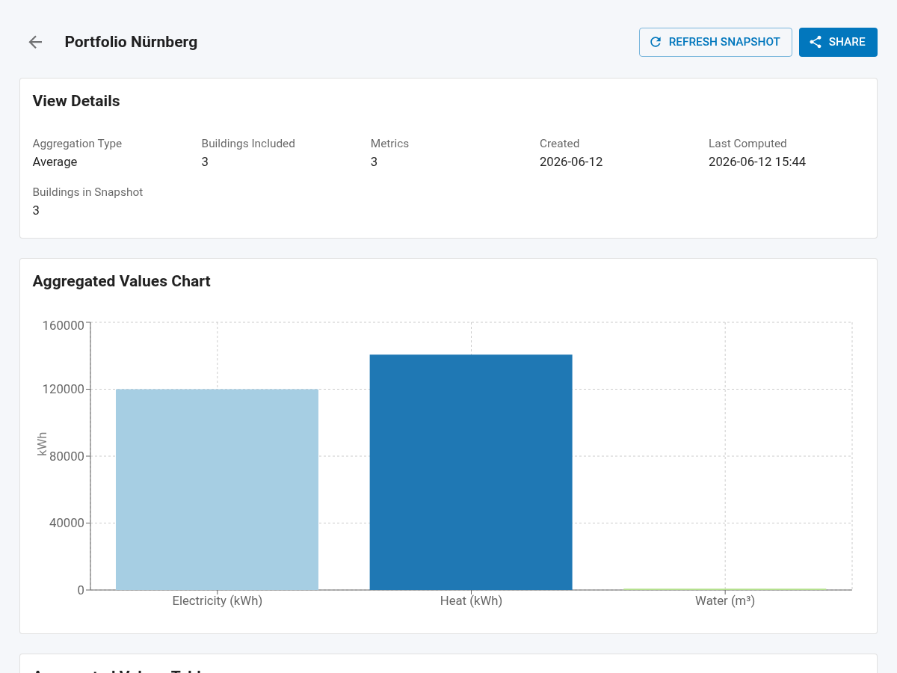{width=100%}

> **Technische Details (für Administratoren)**
>
> Die View-Definition wird in Ihrem Pod gespeichert; die Energiedaten der
> ausgewählten Gebäude werden gelesen und die Aggregation berechnet. Geteilt wird
> ein Snapshot der berechneten Werte – ohne die zugrunde liegenden Gebäude-URIs,
> sodass die Einzelgebäude nicht offengelegt werden.

### Mit Ihnen geteilte Daten

Gebäude, die andere mit Ihnen geteilt haben, finden Sie im Tab **Share** unter
„Buildings shared with you". Sie erscheinen zusätzlich auf der Karte im Tab
**Explore**, sodass Sie sie gemeinsam mit Ihren eigenen Gebäuden auswerten
können. Aggregierte Ansichten, die andere mit Ihnen geteilt haben, finden Sie
ebenda unter „Views shared with you".

{width=100%}

Über das Augen-Symbol können Sie ein mit Ihnen geteiltes Gebäude bei Bedarf aus
Ihrer eigenen Karten- und Listenansicht ausblenden und später wieder einblenden.
Das betrifft nur Ihre persönliche Ansicht – die Freigabe selbst bleibt davon
unberührt.

### Zugriff widerrufen

Eine erteilte Freigabe können Sie jederzeit zurücknehmen: Entfernen Sie beim
jeweiligen Gebäude (bzw. bei der Ansicht) unter „Shared with:" den Empfänger über
das Lösch-Symbol. Der Empfänger wird benachrichtigt; beim nächsten Abruf
verschwindet das Gebäude bzw. die Ansicht aus seiner Liste der mit ihm geteilten
Daten.

> **Technische Details (für Administratoren)**
>
> Beim Widerruf wird der ACL-Eintrag entfernt und der Widerruf im eigenen Pod
> vermerkt. Zusätzlich wird eine Benachrichtigung an den Posteingang des
> Empfängers gesendet; beim nächsten Abruf entfernt dessen Anwendung den Eintrag
> aus der Liste der geteilten Daten. (In einer früheren Version erhielt der
> Empfänger keine Benachrichtigung – dies ist nun behoben.)

# Die Anwendungsfälle durchgespielt

Die vorangegangenen Kapitel beschreiben jeden Arbeitsschritt für sich. Hier
laufen die drei Anwendungsfälle vom Anfang dieses Handbuchs noch einmal als
durchgehende Abläufe ab, in derselben Reihenfolge wie dort – mit wachsender
Zahl der Beteiligten: der Soll-Ist-Vergleich allein auf dem eigenen Pod, die
Vertriebsoptimierung zu zweit (A teilt an B), das Energieverbrauchsbenchmark
zu dritt (A, B und der Dienstleister C). A, B und C sind dabei wieder Alice
Ahlmann, Bob Bauer und Charlie Conrad mit ihren Firmen, wie eingangs im
Abschnitt „Praxisbeispiele: Use Cases für die Anwendung" vorgestellt – in den
Bildschirmfotos etwa als „Shared by: Alice Ahlmann" beim Empfänger oder als
Absender des zurückgeteilten Benchmarks.

## Soll-Ist-Vergleich durchgespielt: Plan und Verbrauch nebeneinander

Beteiligt ist eine einzige Person: **A**, die für ihr Gebäude neben den
tatsächlichen Verbräuchen auch Planwerte führt. Alles spielt sich auf A's
eigenem Pod ab – geteilt wird nichts.

1. A öffnet im Tab **Manage** beim Gebäude den Dialog **„Add / edit energy
   year"** und erfasst ein Jahr mit den **tatsächlichen** (Ist-)Werten (siehe
   „Energiedaten erfassen und aktualisieren").
2. Für dasselbe Jahr legt A einen zweiten Eintrag an und wählt dabei unter
   **Scenario** den Eintrag **Planned (Soll)** – etwa die erwarteten Verbräuche
   aus dem Energieausweis oder nach einer Umrüstung auf LED-Beleuchtung.
3. Im Tab **Explore** wählt A das Gebäude und wechselt zu **Energy data**: Die
   Jahresübersicht zeigt den Soll-Eintrag neben den Ist-Jahren – auf einen
   Blick, wie nah der reale Verbrauch am Plan liegt.

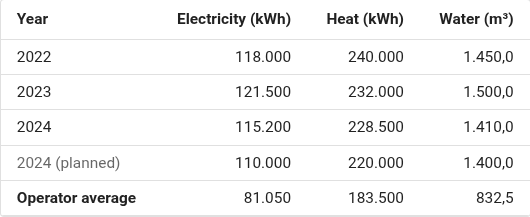{width=100%}

## Vertriebsoptimierung durchgespielt: Ein Gebäude teilen – aus beiden Perspektiven

Beteiligt sind zwei Personen mit jeweils eigenem Solid Pod: **A**, eine
Bestandshalterin, die ein Gebäude mit erfassten Energiejahren verwaltet, und
**B**, ein Geschäftspartner – etwa ein Investor oder ein Makler bzw. Berater,
der sich einen Marktüberblick verschafft (der Anwendungsfall
„Vertriebsoptimierung") –, der diese Daten einsehen soll.
Wichtig vorab: Die Daten werden zu keinem Zeitpunkt kopiert oder an einen
zentralen Dienst übertragen – sie bleiben auf A's Pod, und B liest sie dort
direkt mit seiner eigenen WebID.

**Was A tut (die teilende Seite):**

1. A öffnet im Tab **Manage** unter „Your buildings" das Teilen-Symbol des
   Gebäudes. Der Dialog „Share Building Data" erscheint.
2. A wählt **By WebID** und gibt B's WebID ein – hat A schon einmal mit B
   geteilt, schlägt das Adressbuch (siehe „Kontakte verwalten") die WebID vor.
   Alternativ wählt A **By role**, wenn beide Mitglied desselben Datenraums
   sind und B sich dort eine passende Rolle zugewiesen hat.
3. A legt unter „What to share" den Umfang fest – etwa nur Stammdaten oder
   Stammdaten mit ausgewählten Energiejahren – und bestätigt mit **Share**.

Anschließend sieht A die Freigabe direkt beim Gebäude unter „Shared with:" und
kann sie dort jederzeit wieder entfernen. B wird automatisch in A's Kontakte
aufgenommen.

**Was B sieht (die empfangende Seite):**

1. Die Freigabe-Benachrichtigung landet im Posteingang von B's Pod. Beim
   nächsten Öffnen oder Neuladen der App verarbeitet B's Anwendung sie
   automatisch – B muss dafür nichts tun.
2. Das Gebäude erscheint bei B im Tab **Share** unter „Buildings shared with
   you" und zusätzlich auf der Karte im Tab **Explore**, dort als geteiltes
   Gebäude gekennzeichnet und neben B's eigenen Gebäuden auswertbar – auch in
   der Energie-Linse, die geteilte Gebäude in B's Marktüberblick einbezieht.
3. B öffnet das Gebäude und sieht genau das, was A freigegeben hat: die
   Stammdaten und – je nach gewähltem Umfang – die Energiejahre. Hat A „alle
   Energiejahre" freigegeben, sieht B auch Jahre, die A erst später erfasst.
4. Möchte B das Gebäude vorübergehend nicht in seinen Listen sehen, blendet er
   es über das Augen-Symbol aus – die Freigabe selbst bleibt bestehen.

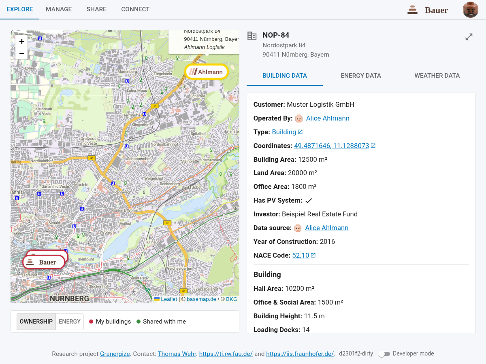{width=100%}

Widerruft A die Freigabe später (siehe „Zugriff widerrufen"), wird B
benachrichtigt, und das Gebäude verschwindet beim nächsten Abruf aus B's
Ansicht. Beide Seiten behalten so jederzeit den Überblick: A sieht in ihrem Pod,
was sie an wen freigegeben hat; B sieht, was mit ihm geteilt wurde – und beides
bleibt auch nach dem Widerruf nachvollziehbar.

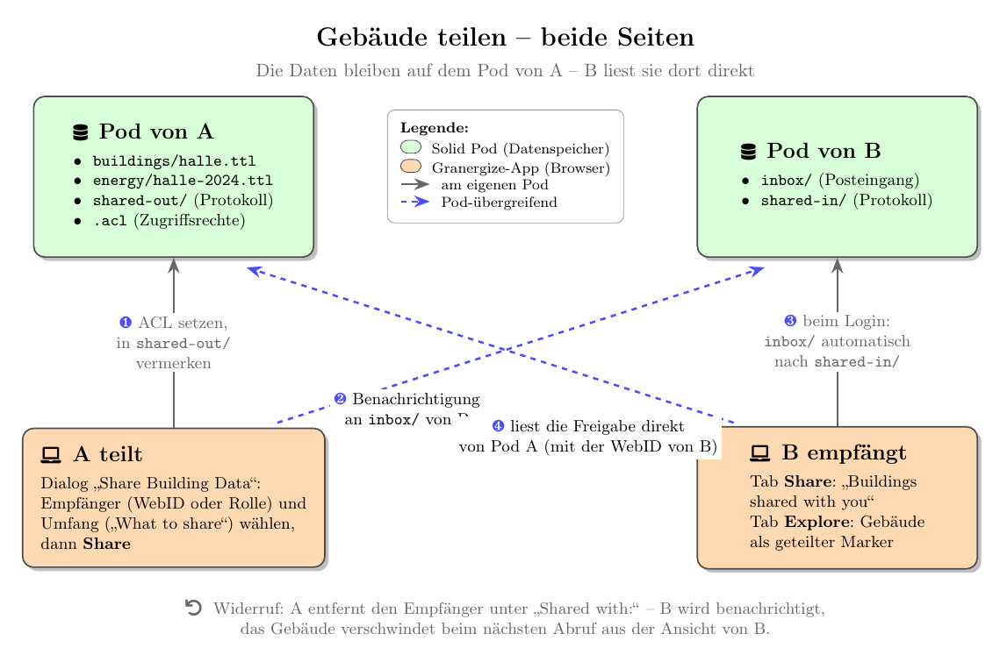{width=100%}

## Energieverbrauchsbenchmark durchgespielt: Peer-Benchmarking mit einem Benchmark-Dienstleister

Ein einzelner Bestandshalter kann seine Gebäude nur mit dem eigenen Portfolio
vergleichen. Ein echter **Peer-Vergleich** – „Wie steht mein Gebäude im
Branchendurchschnitt da?", der eingangs beschriebene Anwendungsfall
„Energieverbrauchsbenchmark" – braucht Daten mehrerer Eigentümer, ohne dass
diese ihre Gebäude einander offenlegen müssen. Genau das leistet das
Zusammenspiel von Gebäude-Freigabe und aggregierten Ansichten, mit drei
Beteiligten:

- **A** und **B** sind Bestandshalter mit eigenen Gebäuden und Energiedaten.
  Sie kennen einander nicht notwendigerweise und sehen gegenseitig keine Daten.
- **C** ist ein **Benchmark-Dienstleister** (Benchmark Service Provider) – kein
  Server und kein Sonderkonto, sondern ein gewöhnlicher Nutzer derselben App
  mit eigenem Pod.

**Was A und B tun (die beitragende Seite):**

1. Jeder teilt seine Gebäude über den normalen Teilen-Dialog an C – genau die
   Schritte aus „Vertriebsoptimierung durchgespielt", nur dass A unter „What to share" diesmal
   **einschließlich Energiedaten** freigibt, wahlweise alle Jahre oder gezielt
   ausgewählte.
2. Sind alle drei Mitglied desselben Datenraums, geht es auch in einem Zug
   rollenbasiert: **By role** an die Rolle **Benchmark Service Provider**
   erreicht C, ohne dass A und B dessen WebID kennen müssen.

**Was C tut (der Dienstleister):**

1. Die Beiträge von A und B erreichen C wie jedes geteilte Gebäude: Sie
   erscheinen im Tab **Share** unter „Buildings shared with you".
2. C wechselt im Tab **Manage** zum Abschnitt „Aggregated views", klickt
   **Create View** und wählt die Art **Compare shared buildings**. Zur Auswahl
   stehen genau die Gebäude, die **mit C geteilt** wurden – also die Beiträge
   von A und B.
3. C vergibt einen Namen, wählt die Kennzahlen (jährlicher Strom-, Wärme-,
   Wasser- und Abwasserverbrauch) und die Aggregatsfunktion **Durchschnitt**
   und erstellt die Ansicht; beim ersten Öffnen berechnet die App das Ergebnis
   als Snapshot (siehe „Aggregierte Ansicht erstellen und teilen").
4. C teilt die fertige Ansicht über das Teilen-Symbol an alle Beitragenden
   zurück. Im Teilen-Dialog bietet die App dafür eine Ein-Klick-Hilfe an:
   **Add all contributors** trägt automatisch alle ein, deren Gebäude in den
   Benchmark eingeflossen sind – hier A und B.

**Was A und B sehen (der Rückfluss):**

1. Die zurückerhaltene Ansicht erscheint im Tab **Share** unter „Views shared
   with you" – mit den empfangenen Durchschnittswerten zum Aufklappen (siehe
   die Abbildung im Abschnitt „Mit Ihnen geteilte Daten").
2. Vor allem aber füllt sich auf der Energie-Detailseite der eigenen Gebäude
   die Spalte **Benchmark**: Der eigene Verbrauch wird nun gegen den externen
   Branchenwert eingefärbt statt nur gegen den eigenen Portfolio-Durchschnitt,
   und ein Hinweis nennt den Dienstleister, der den Benchmark berechnet hat.

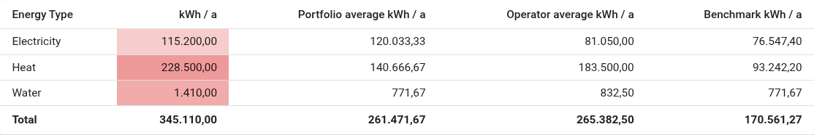{width=100%}

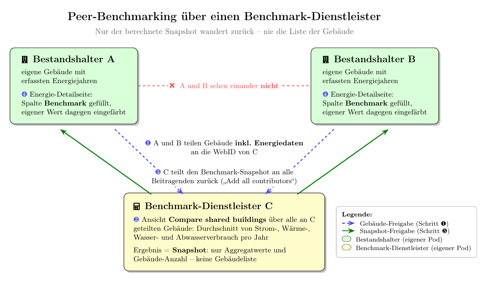{width=100%}

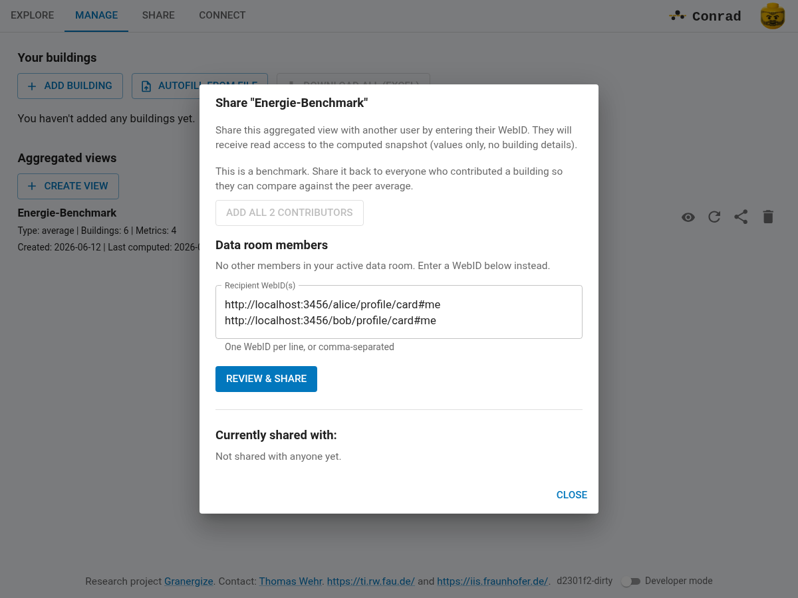{width=100%}

Entscheidend ist, was dabei **nicht** sichtbar wird: A und B sehen zu keinem
Zeitpunkt die Gebäude des jeweils anderen. Der zurückgeteilte Snapshot enthält
nur die berechneten Durchschnittswerte und die Anzahl der eingeflossenen
Gebäude – nicht, welche Gebäude das waren. Jeder Beitragende kann seine
Freigabe an C zudem jederzeit widerrufen und steigt damit aus künftigen
Benchmark-Berechnungen aus.

> **Technische Details (für Administratoren)**
>
> Die View-Definition – sie enthält die IRIs der beitragenden Gebäude – bleibt
> auf C's Pod und wird nie geteilt; nur der berechnete Snapshot wandert zu den
> Empfängern. Der Snapshot ist dabei als Benchmark-Ergebnis typisiert und
> vermerkt den berechnenden Agenten und den abgedeckten Zeitraum, sodass die
> Energie-Ansicht der Empfänger ihn von gewöhnlichen geteilten Ansichten
> unterscheiden und als Vergleichswert bevorzugen kann (Reihenfolge: externer
> Benchmark vor Betreiber-Durchschnitt vor Portfolio-Durchschnitt).

# Was steckt hinter Granergize

Die in diesem Handbuch beschriebene Webanwendung entstand im Rahmen des
Forschungsprojekts **Granergize – Graphenbasierter Datenraum für
energieeffiziente Logistikimmobilien**. Ziel des Projekts ist es, die Transparenz
und Vergleichbarkeit energierelevanter Daten in Logistikimmobilien zu verbessern
und dadurch die Grundlage für ein effizienteres Energiemanagement zu schaffen. Im
Mittelpunkt steht der Aufbau eines semantischen Datenmodells einschließlich einer
Domänen-Ontologie. Auf dieser Grundlage wird ein Wissensgraph entwickelt, der
unterschiedliche Datenquellen zusammenführt und in einheitlicher Form nutzbar
macht. Dadurch sollen energetische Informationen konsistent ausgewertet und
sowohl unternehmensintern als auch -übergreifend bereitgestellt werden können.
Die entwickelte Webanwendung dient dabei als zentrale Benutzeroberfläche für den
Zugriff auf die im Wissensgraphen verwalteten Daten.

Das Forschungsprojekt ist ein Vorhaben der Industriellen Gemeinschaftsforschung
(IGF) und wird durch das Bundesministerium für Wirtschaft und Energie (BMWE) gefördert
(Förderkennzeichen 01IF23286N). Das Projekt läuft von April 2024 bis Juni 2026
und wird gemeinsam von Partnern aus Wissenschaft und Wirtschaft umgesetzt –
beteiligt sind das Fraunhofer IIS, die Friedrich-Alexander-Universität
Erlangen-Nürnberg sowie einzelne Praxispartner aus dem
Logistikimmobilienökosystem.

Die Granergize-App ist **quelloffen**: Der Quellcode steht unter der GNU Affero
General Public License, Version 3 (AGPL-3.0) auf GitHub zur Verfügung –
[github.com/wintechis/granergize-webapp](https://github.com/wintechis/granergize-webapp).
Die Lizenz erlaubt es jedem, die Anwendung frei zu nutzen, den Quellcode zu
prüfen, sie anzupassen und selbst zu betreiben (siehe Abschnitt „Einen eigenen
Solid-Server betreiben"); wer eine veränderte Fassung als Dienst anbietet, muss
deren Quellcode ebenfalls offenlegen. Für die Trennung von Identität, Daten und
Anwendung heißt das: Auch der dritte Baustein ist überprüfbar und liegt nicht
in der Hand eines einzelnen Anbieters.

# Literaturverzeichnis

[1] A. Nehm, U. Veres-Homm, C. Kille (2009). *Logistikimmobilien in Deutschland:
Markt und Standorte; eine Studie mit der Unterstützung von Deka Immobilien,
Goldbeck, ING Real Estate, Jones Lang LaSalle, ProLogis.* Fraunhofer-Verlag,
Stuttgart.

[2] Statistisches Bundesamt (2023). *Daten zur Energiepreisentwicklung, Lange
Reihen von Januar 2005 bis Dezember 2022.* Wiesbaden.

[3] European Commission (2022). *EU taxonomy for sustainable activities.* URL:
<https://finance.ec.europa.eu/sustainable-finance/tools-and-standards/eu-taxonomy-sustainable-activities_en>
