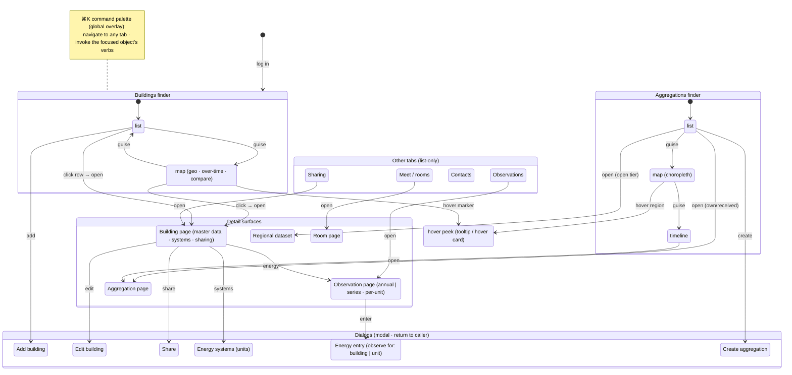

# UX overview

A coarse, semi-formal capture of the app's user experience — *surfaces and the
transitions between them*, one level above a full statechart (it deliberately stops
short of per-dialog field states and guard conditions). It answers "where can I be,
and how do I move?", not "what every control does".

Three layers:

- **App-shell tabs** — the finders. The multi-guise ones carry their **guise
  sub-states**: Buildings → *list | map* (the map itself has geo · over-time ·
  compare views), Aggregations → *list | map | timeline*; the rest (Observations,
  Sharing, Contacts, Meet/rooms) are list-only. Tabs switch freely, so the tab↔tab
  edges are left implicit; the guise toggle *within* a finder is drawn (dotted).
- **Detail surfaces** — what you drill into from a finder (master → detail): the
  building, observation, aggregation, regional-dataset and room pages. A few
  detail↔detail moves exist (a building page links to its observation page).
- **Dialogs** — modal; on save or cancel they close back to their caller. The clean
  overview omits these return-edges for legibility; the **returns variant** draws them
  as grey dashed "done" edges (constraint-free, so they don't fight the layout).

**Details-on-demand** is shown as two tiers: a **hover peek** (a tooltip / hover card,
in place — the green dashed edges from the map guises) and **click → open** (the full
detail page — the solid edges). List rows open directly; the choropleth peeks but is
view-only.

Cross-cutting: the **⌘K command palette** is a global overlay reachable from
anywhere — it *navigates* to any tab and *invokes* the focused object's verbs (the
orange dotted edges). It is the keyboard/power-user path over the same intents the
per-object action menus expose.

## The diagrams

Two Graphviz views, same model at the same level — pick by how much you want on screen. Only the
`.dot` sources are checked in; the `.svg`/`.png` are generated (gitignored) — render them locally:

- [`ux-overview.dot`](./ux-overview.dot) — the **clean forward-flow overview** (no dialog
  return-edges); easiest to read.
- [`ux-overview-returns.dot`](./ux-overview-returns.dot) — the same map **plus the dialog
  return-edges** (save/cancel → caller), so the modal open↔close loop is explicit; busier.

Render (re-run after editing either `.dot`):

```sh
dot -Tsvg ux-overview.dot         -o ux-overview.svg
dot -Tsvg ux-overview-returns.dot -o ux-overview-returns.svg
# (-Tpng -Gdpi=120 for the PNGs)
```

Graphviz clusters give the three-layer grouping; it's the better fit here. The clean overview as
Mermaid (renders inline on GitHub) is below — kept in step with the `.dot`:


